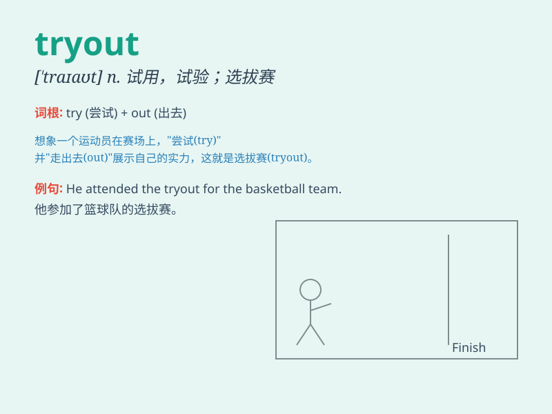

## tryout

**英音:** _[\'traɪaʊt]_ **美音:** _[\'traɪaʊt]_

**译义:** *n.试验,试用,尝试,预赛(试),预演*

### 短语

+ **tryout for:** _参加......的选拔_

+ **tryout session:** _选拔期；试用阶段_

+ **tryout competition:** _选拔比赛_

+ **new product tryout:** _新产品试用_

+ **athletic tryout:** _体育选拔_

### 例句

#### 例句1

> **The athlete is preparing for the tryout of the national team.**

**中文翻译:** 这位运动员正在为国家队的选拔做准备。

**单词释义:** 选拔；试用

#### 例句2

> **We had a tryout of the new software yesterday.**

**中文翻译:** 昨天我们试用了新软件。

**单词释义:** 试用；测试

#### 例句3

> **The singer\'s tryout on the stage was impressive.**

**中文翻译:** 这位歌手在舞台上的试演令人印象深刻。

**单词释义:** 试演；试唱

### 背诵小故事

> One day, a young athlete had a tryout for the school\'s basketball
team. He was nervous but gave it his best shot. After the tryout, he
waited anxiously for the result. Finally, he was selected! The tryout
was a success.

**一天，一位年轻的运动员参加了学校篮球队的选拔。他很紧张，但全力以赴。选拔结束后，他焦急地等待结果。最终，他被选中了！这次选拔很成功。**

### 图义

