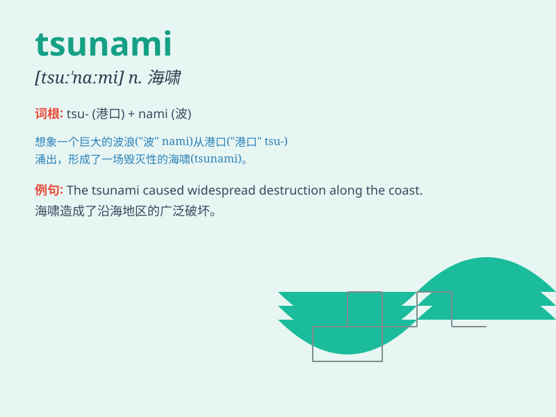

## tsunami

**英音:** _[tsuː\'nɑːmɪ]_ **美音:** _[tsʊ\'nɑmi]_

**译义:** *n.海啸*

### 短语

+ **tsunami warning:** _海啸警报_

+ **tsunami wave:** _海啸波_

+ **tsunami disaster:** _海啸灾难_

+ **tsunami alert:** _海啸预警_

+ **tsunami damage:** _海啸破坏_

### 例句

#### 例句1

> **The tsunami caused widespread destruction along the coast.**

**中文翻译:** 海啸在沿海地区造成了广泛的破坏。

**单词释义:** 海啸

#### 例句2

> **A powerful tsunami hit the island, leaving many people
homeless.**

**中文翻译:** 一场强大的海啸袭击了这个岛屿，致使许多人无家可归。

**单词释义:** 海啸

#### 例句3

> **Scientists are studying ways to predict tsunamis more
accurately.**

**中文翻译:** 科学家们正在研究更准确地预测海啸的方法。

**单词释义:** 海啸

### 背诵小故事

> One day, Tom was happily playing on the beach. Suddenly, the sea
roared and a huge wave rushed towards the shore. People shouted,
\'Tsunami!\' It was a terrifying scene. Tom ran for his life.

**有一天，汤姆正在海滩上愉快地玩耍。突然，大海咆哮起来，一个巨大的波浪冲向岸边。人们大喊："海啸！"
这是一个可怕的场景。汤姆拼命逃跑。**

### 图义

