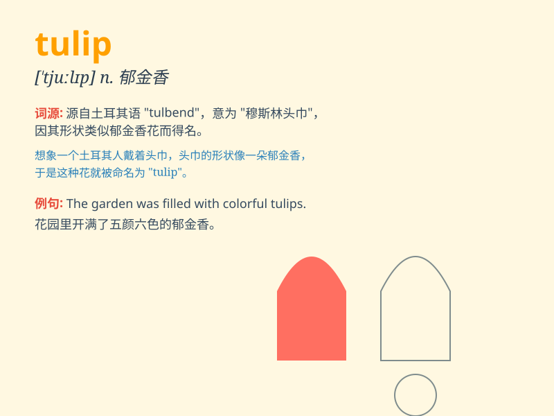

## tulip

**英音:** _[\'tjuːlɪp]_ **美音:** _[\'tʊlɪp]_

**译义:** *n.[植]郁金香,郁金香花,郁金香球茎*

### 短语

+ **tulip garden:** _郁金香花园_

+ **tulip bulb:** _郁金香球茎_

+ **wild tulip:** _野生郁金香_

+ **tulip festival:** _郁金香节_

+ **colorful tulip:** _色彩斑斓的郁金香_

### 例句

#### 例句1

> **The tulip garden is a sea of colors in spring.**

**中文翻译:** 春天，郁金香花园是一片色彩的海洋。

**单词释义:** 郁金香（指花园中的郁金香这种花）

#### 例句2

> **She received a bouquet of tulips on her birthday.**

**中文翻译:** 她在生日那天收到了一束郁金香。

**单词释义:** 郁金香（指花束中的郁金香）

#### 例句3

> **The red tulip stands out among the white ones.**

**中文翻译:** 那朵红色的郁金香在白色的郁金香中显得很突出。

**单词释义:** 郁金香（指特定的某一朵郁金香）

### 背诵小故事

> One day, a little girl named Lily was walking in the garden.
Suddenly, she saw a beautiful flower. She asked her mom what it was. Her
mom said, \'It\'s a tulip, dear. It\'s like a princess among flowers.\'

**有一天，一个叫莉莉的小女孩在花园里散步。突然，她看到一朵漂亮的花。她问妈妈这是什么。她妈妈说：'亲爱的，这是郁金香。它就像花中的公主。'**

### 图义

