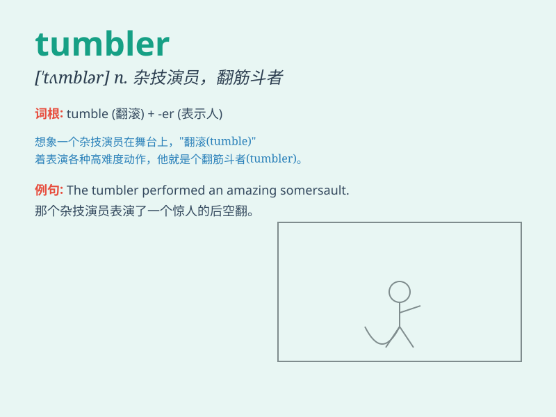

## tumbler

**英音:** _[\'tʌmblə]_ **美音:** _[\'tʌmblɚ]_

**译义:** *n.打滚的人,翻筋斗者,杂技演员,(平底)大玻璃杯,一杯量*

### 短语

+ **tumbler pigeon:** _翻飞鸽_

+ **tumbler dryer:** _滚筒式烘干机_

+ **glass tumbler:** _玻璃酒杯_

+ **tumbler switch:** _翻转开关_

+ **lock tumbler:** _锁芯_

### 例句

#### 例句1

> **The tumbler on the table was filled with water.**

**中文翻译:** 桌子上的平底玻璃杯装满了水。

**单词释义:** 平底玻璃杯

#### 例句2

> **The gymnast performed a perfect tumbler routine.**

**中文翻译:** 这位体操运动员完成了一套完美的翻筋斗动作。

**单词释义:** 翻筋斗

#### 例句3

> **The lock has a special tumbler mechanism.**

**中文翻译:** 这把锁有一个特殊的锁芯装置。

**单词释义:** 锁芯

### 背诵小故事

> A little monkey was playing in the circus. It was very good at
jumping through hoops and landing precisely in a tumbler. The tumbler
was like its special stage, making it the star of the show.

**一只小猴子在马戏团里表演。它很擅长跳圈，然后精准地落到一个平底玻璃杯里。这个平底玻璃杯就像它的专属舞台，让它成为了表演的明星。**

### 图义

