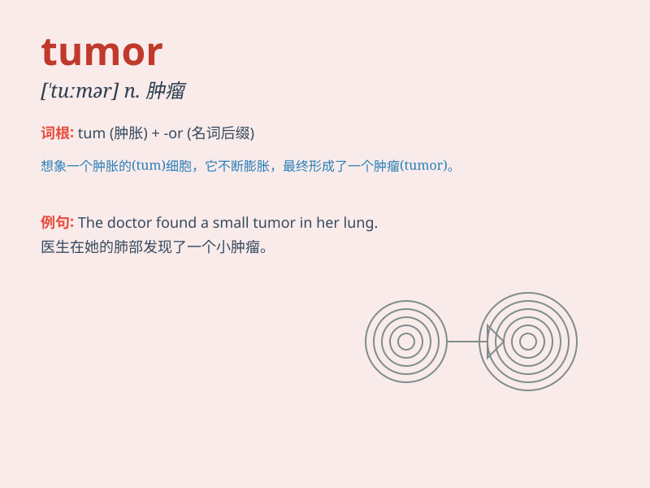

## tumor

**英音:** _[ˈtuːmə(r)]_ **美音:** _[ˈtuːmər]_

**译义:** *n.肿瘤，肿块；vt.长出肿瘤*

### 短语

+ **brain tumor:** _脑瘤_

+ **malignant tumor:** _恶性肿瘤_

+ **benign tumor:** _良性肿瘤_

+ **tumor growth:** _肿瘤生长_

+ **tumor cell:** _肿瘤细胞_

### 例句

#### 例句1

> **The doctor found a tumor in her lung.**

**中文翻译:** 医生在她的肺部发现了一个肿瘤。

**单词释义:** 肿瘤

#### 例句2

> **The tumor was benign and not a cause for serious concern.**

**中文翻译:** 这个肿瘤是良性的，不是严重担忧的原因。

**单词释义:** 肿瘤

#### 例句3

> **Surgery was necessary to remove the tumor.**

**中文翻译:** 手术对于移除肿瘤是必要的。

**单词释义:** 肿瘤

### 背诵小故事

> A brave doctor was trying to save a patient with a tumor. The tumor
was like a monster growing inside the body. But the doctor was
determined to defeat it and bring health back.

**一位勇敢的医生正努力救治一位患有肿瘤的病人。肿瘤就像身体里生长的怪物。但医生决心打败它，让病人恢复健康。**

### 图义

