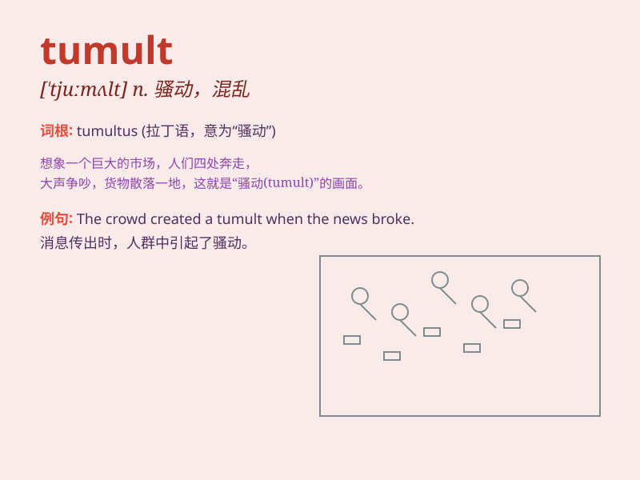

## tumult

**英音:** _[\'tjuːmʌlt]_ **美音:** _[\'tumʌlt]_

**译义:** *n.吵闹,骚动,拥挤,混乱*

### 短语

+ **in tumult:** _处于混乱中_

+ **tumult of emotions:** _情绪的混乱_

+ **create a tumult:** _制造混乱_

+ **tumult and chaos:** _骚乱与混乱_

+ **amid the tumult:** _在混乱之中_

### 例句

#### 例句1

> **The city was in tumult after the football team won the
championship.**

**中文翻译:** 这座城市在足球队赢得冠军后陷入了一片骚乱。

**单词释义:** 骚乱；动乱

#### 例句2

> **Her mind was in a tumult as she tried to make the difficult
decision.**

**中文翻译:** 当她试图做出这个艰难的决定时，她的头脑一片混乱。

**单词释义:** 混乱；心烦意乱

#### 例句3

> **The political tumult led to significant changes in the
country.**

**中文翻译:** 政治上的动荡导致了这个国家的重大变革。

**单词释义:** 动荡；骚动

### 背诵小故事

> A king\'s sudden decision to change the law caused a tumult in the
kingdom. People were shouting and protesting everywhere. The chaos and
noise were what \'tumult\' means.

**一位国王突然决定更改法律，这在王国里引起了骚乱。人们到处呼喊和抗议。这种混乱和嘈杂就是\'tumult\'的意思。**

### 图义

