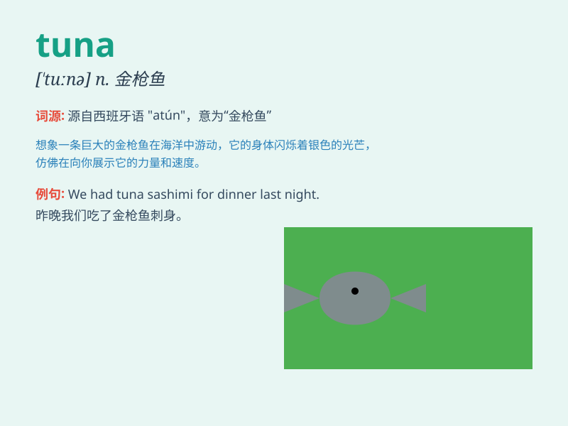

## tuna

**英音:** _[\'tjuːnə]_ **美音:** _[\'tunə]_

**译义:** *n.金枪鱼n.[动] 鲔鱼*

### 短语

+ **tuna fish:** _金枪鱼_

+ **tuna salad:** _金枪鱼沙拉_

+ **tuna steak:** _金枪鱼排_

+ **canned tuna:** _金枪鱼罐头_

+ **fresh tuna:** _新鲜的金枪鱼_

### 例句

#### 例句1

> **I had a delicious tuna sandwich for lunch.**

**中文翻译:** 我午餐吃了一个美味的金枪鱼三明治。

**单词释义:** 金枪鱼

#### 例句2

> **The fisherman caught a huge tuna.**

**中文翻译:** 这位渔夫捕到了一条巨大的金枪鱼。

**单词释义:** 金枪鱼

#### 例句3

> **Tuna is a popular choice for sushi lovers.**

**中文翻译:** 对于寿司爱好者来说，金枪鱼是一个受欢迎的选择。

**单词释义:** 金枪鱼

### 背诵小故事

> A hungry cat was wandering around. One day, it smelled a delicious
smell and followed it. It found a big tuna fish on a table. The cat was
so excited and couldn\'t wait to have a taste.

**一只饥饿的猫四处游荡。有一天，它闻到一股美味的气味并跟着它。它发现桌子上有一条大金枪鱼。猫非常兴奋，迫不及待地想尝一尝。**

### 图义

