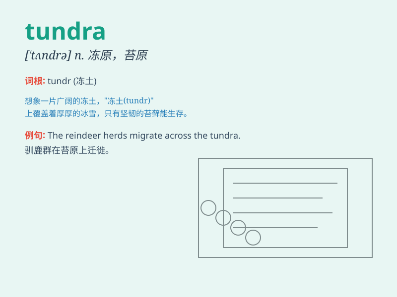

## tundra

**英音:** _[\'tʌndrə]_ **美音:** _[\'tʌndrə]_

**译义:** *n.苔原,冻土地带*

### 短语

+ **arctic tundra:** _北极冻原_

+ **tundra climate:** _冻原气候_

+ **tundra biome:** _冻原生物群落_

+ **tundra vegetation:** _冻原植被_

+ **alpine tundra:** _高山冻原_

### 例句

#### 例句1

> **The tundra is a harsh and inhospitable environment.**

**中文翻译:** 冻原是一个恶劣且不适宜居住的环境。

**单词释义:** 冻原

#### 例句2

> **Animals have adapted to survive in the tundra.**

**中文翻译:** 动物已经适应在冻原中生存。

**单词释义:** 冻原

#### 例句3

> **The tundra landscape is characterized by low-growing plants.**

**中文翻译:** 冻原景观的特点是低矮的植物。

**单词释义:** 冻原

### 背诵小故事

> A brave explorer was lost in the vast tundra. It was a cold and
desolate place with no trees, just endless icy plains. He struggled to
find his way, realizing the tundra was a harsh and lonely world.

**一位勇敢的探险家在广袤的冻原迷路了。这里寒冷荒凉，没有树木，只有一望无际的冰原。他艰难地寻找出路，意识到冻原是一个严酷又孤寂的世界。**

### 图义

