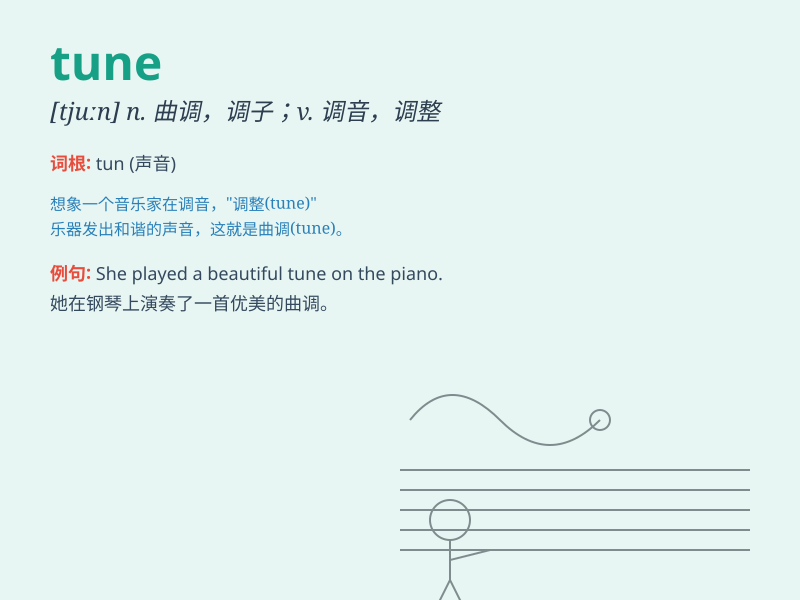

## tune

**英音:** _[tjuːn]_ **美音:** _[tun]_

**译义:**
*n.曲调,调子,和谐,合调vt.调音,调整,拨收,收听,知道或察觉他人所说的话或表现的情绪*

### 短语

+ **in tune:** _（音乐）合调；协调；融洽_

+ **out of tune:** _（音乐）走调；不协调；不融洽_

+ **tune in:** _收听；收看；调谐_

+ **tune out:** _不理会；对...充耳不闻_

+ **fine-tune:** _微调；精心调整_

### 例句

#### 例句1

> **She hummed a tune while doing the dishes.**

**中文翻译:** 她在洗碗时哼着一支曲子。

**单词释义:** 曲子；旋律

#### 例句2

> **You need to tune your guitar before the performance.**

**中文翻译:** 在表演前你需要给你的吉他调音。

**单词释义:** 调整；调试

#### 例句3

> **The engine is out of tune and needs servicing.**

**中文翻译:** 发动机失调了，需要维修。

**单词释义:** 协调；和谐

### 背诵小故事

> A musician was struggling to create a beautiful tune. After days of
hard work and many attempts, he finally composed a wonderful melody that
everyone loved. The \'tune\' became a hit!

**一位音乐家努力创作优美的曲调。经过数日的辛勤工作和多次尝试，他最终谱出了一首人人喜爱的美妙旋律。这个"曲调"大受欢迎！**

### 图义

