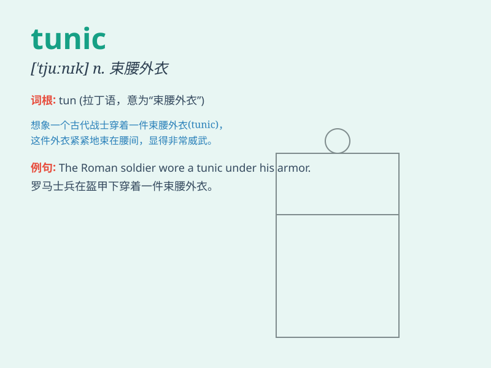

## tunic

**英音:** _[\'tjuːnɪk]_ **美音:** _[\'tʊnɪk]_

**译义:** *n.束腰外衣*

### 短语

+ **tunic dress:** _束腰连衣裙_

+ **priest\'s tunic:** _牧师的长袍_

+ **tunic top:** _束腰上衣_

+ **long tunic:** _长款束腰外衣_

+ **short tunic:** _短款束腰外衣_

### 例句

#### 例句1

> **She wore a beautiful tunic with intricate embroidery.**

**中文翻译:** 她穿着一件带有精美刺绣的漂亮束腰外衣。

**单词释义:** 束腰外衣

#### 例句2

> **The soldier\'s tunic was neatly pressed and clean.**

**中文翻译:** 士兵的束腰外衣熨烫得整整齐齐，很干净。

**单词释义:** （士兵的）束腰外衣

#### 例句3

> **He bought a simple tunic for the summer.**

**中文翻译:** 他为夏天买了一件简单的束腰长衫。

**单词释义:** 束腰长衫

### 背诵小故事

> A brave knight wore a special tunic in the battle. The tunic was blue
and had a golden emblem on it. It protected the knight and made him look
very heroic. Remember the knight\'s tunic to remember the word.

**一位勇敢的骑士在战斗中穿着一件特别的束腰外衣。这件束腰外衣是蓝色的，上面有一个金色的徽章。它保护着骑士，让他看起来非常英勇。记住骑士的束腰外衣就能记住这个单词。**

### 图义

