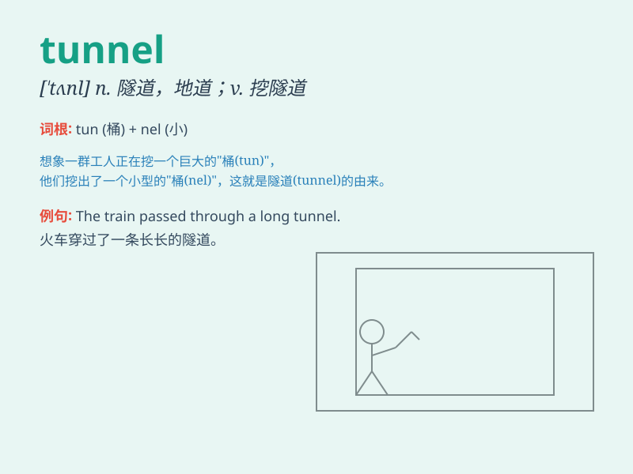

## tunnel

**英音:** _[\'tʌnl]_ **美音:** _[\'tʌnl]_

**译义:** *n.隧道,地道*

### 短语

+ **tunnel vision:** _井蛙之见；狭窄的视野_

+ **wind tunnel:** _风洞_

+ **tunnel through:** _挖隧道穿过_

+ **railway tunnel:** _铁路隧道_

+ **car tunnel:** _汽车隧道_

### 例句

#### 例句1

> **The train passed through a long tunnel.**

**中文翻译:** 火车穿过了一条长长的隧道。

**单词释义:** 隧道

#### 例句2

> **The miners dug a tunnel to reach the coal seam.**

**中文翻译:** 矿工们挖了一条隧道以到达煤层。

**单词释义:** 隧道

#### 例句3

> **The light at the end of the tunnel gave them hope.**

**中文翻译:** 隧道尽头的光给了他们希望。

**单词释义:** 隧道

### 背诵小故事

> A mouse was lost in a dark place. It kept running and finally found a
tunnel. Through the tunnel, it saw the light and reached a safe field.
The tunnel was its way to freedom.

**一只老鼠在黑暗中迷路了。它一直跑，最后发现了一条隧道。穿过隧道，它看到了光，到达了安全的地方。这条隧道是它通往自由的路。**

### 图义

