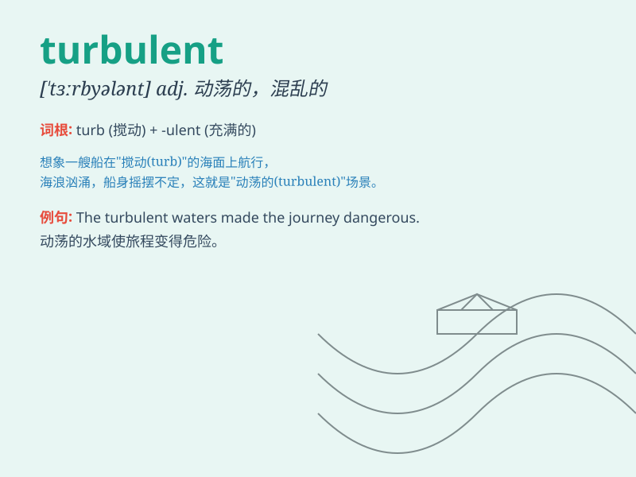

## turbulent

**英音:** _[\'tɜːbjʊl(ə)nt]_ **美音:** _[\'tɝbjələnt]_

**译义:** *adj.狂暴的,吵闹的*

### 短语

+ **turbulent flow:** _湍流；紊流_

+ **turbulent times:** _动荡时期_

+ **turbulent air:** _湍流空气；紊乱的气流_

+ **turbulent current:** _涡流；湍急的水流_

+ **turbulent atmosphere:** _动荡的气氛；不稳定的大气_

### 例句

#### 例句1

> **The river was turbulent after the heavy rain.**

**中文翻译:** 大雨过后，这条河水流湍急。

**单词释义:** 湍急的；汹涌的

#### 例句2

> **The country is going through a turbulent period of political
change.**

**中文翻译:** 这个国家正在经历一段政治变革的动荡时期。

**单词释义:** 动荡的；骚乱的

#### 例句3

> **The turbulent crowd made it difficult for the police to maintain
order.**

**中文翻译:** 骚乱的人群使警察难以维持秩序。

**单词释义:** 骚乱的；混乱的

### 背诵小故事

>
想象一下，你正在乘坐一艘小船在大海上航行，突然海浪变得汹涌澎湃，水流混乱，船身剧烈摇晃。这种混乱、汹涌的海面就是\'turbulent\'。

**想象你乘船航行时遇到汹涌混乱的海面来记\'turbulent\'，意思是动荡的；骚乱的；汹涌的**

### 图义

