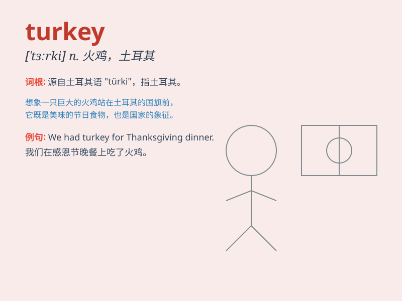

## turkey

**英音:** _[\'tɜːkɪ]_ **美音:** _[\'tɝki]_

**译义:** *n.火鸡,无用的东西 Turkey 土耳其*

### 短语

+ **roast turkey:** _烤火鸡_

+ **wild turkey:** _野火鸡_

+ **turkey shoot:** _容易的射击比赛；一边倒的竞赛_

+ **talk turkey:** _坦率地说；谈正经事_

+ **cold turkey:** _突然停止（坏习惯）；突然戒毒_

### 例句

#### 例句1

> **We had roast turkey for Thanksgiving dinner.**

**中文翻译:** 我们在感恩节晚餐吃了烤火鸡。

**单词释义:** 火鸡（指可食用的动物）

#### 例句2

> **The project was a turkey from the start.**

**中文翻译:** 这个项目从一开始就是个失败之作。

**单词释义:** 失败之作（比喻）

#### 例句3

> **She dressed up as a turkey for the costume party.**

**中文翻译:** 她在化妆舞会上装扮成一只火鸡。

**单词释义:** 火鸡（形象）

### 背诵小故事

> A little boy went to a farm and saw a big bird. The farmer told him
it was a turkey. The turkey had colorful feathers and walked funny. The
boy remembered it well because it was so special.

**一个小男孩去农场看到一只大鸟。农民告诉他这是一只火鸡。这只火鸡有彩色的羽毛，走路姿势很滑稽。小男孩记得很清楚，因为它太特别了。**

### 图义

