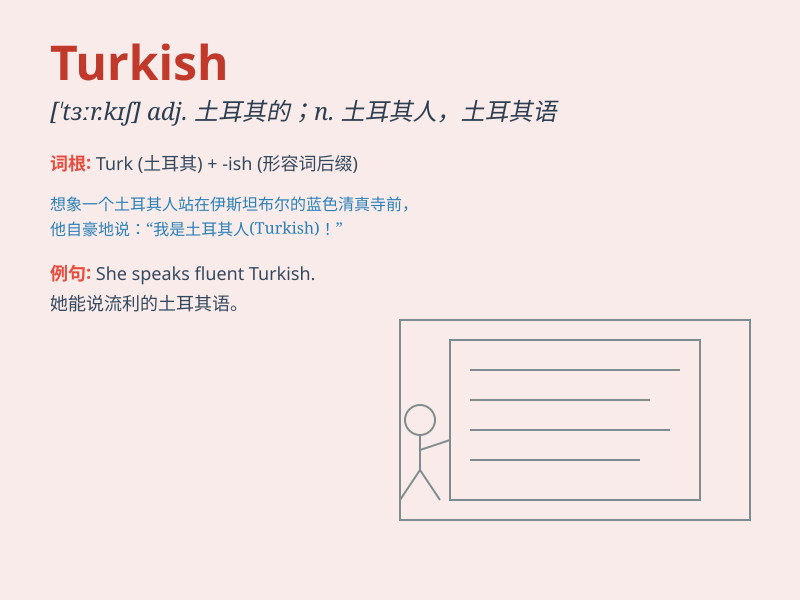

## Turkish

**英音:** _[ˈtɜːkɪʃ]_ **美音:** _[ˈtɜrkɪʃ]_

**译义:** *adj. 土耳其的；土耳其人的；n. 土耳其语；土耳其人*

### 短语

+ **Turkish delight:** _土耳其软糖_

+ **Turkish bath:** _土耳其浴_

+ **Turkish coffee:** _土耳其咖啡_

+ **Turkish carpet:** _土耳其地毯_

+ **Turkish Airlines:** _土耳其航空公司_

### 例句

#### 例句1

> **I\'m learning Turkish because I want to travel to Istanbul.**

**中文翻译:** 我正在学习土耳其语，因为我想去伊斯坦布尔旅行。

**单词释义:** 土耳其语

#### 例句2

> **The Turkish cuisine is famous for its rich flavors.**

**中文翻译:** 土耳其美食以其丰富的口味而闻名。

**单词释义:** 土耳其的

#### 例句3

> **She wore a beautiful Turkish carpet in her living room.**

**中文翻译:** 她在客厅里铺了一块漂亮的土耳其地毯。

**单词释义:** 土耳其的

### 背诵小故事

> Once upon a time, Tom traveled to a mysterious land. There, he met a
friendly man who spoke Turkish. The man taught Tom some basic Turkish
words and showed him the beauty of the Turkish culture. Tom was amazed!

**从前，汤姆去了一个神秘的地方旅行。在那里，他遇到了一个友好的会说土耳其语的人。这个人教了汤姆一些基本的土耳其语单词，并向他展示了土耳其文化的美。汤姆感到很惊讶！**

### 图义

