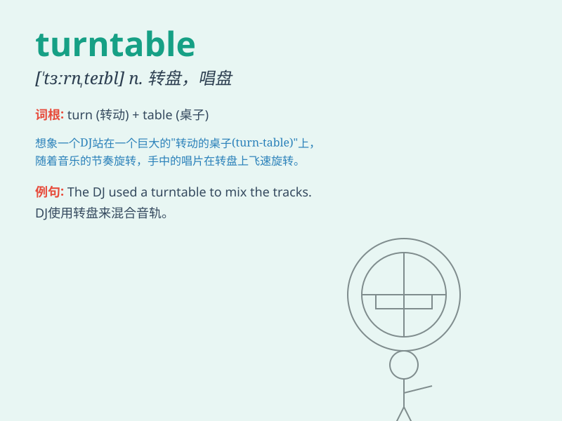

## turntable

**英音:** _[\'tɜːnteɪb(ə)l]_ **美音:** _[\'tɝntebl]_

**译义:** *n.转车,转盘*

### 短语

+ **vinyl turntable:** _黑胶唱片机_

+ **DJ turntable:** _DJ 唱片机_

+ **rotating turntable:** _旋转的转盘_

+ **turntable record player:** _转盘式唱片机_

+ **portable turntable:** _便携式转盘_

### 例句

#### 例句1

> **The DJ skillfully operated the turntable to create an
electrifying atmosphere.**

**中文翻译:** 这位 DJ 熟练地操作转盘以营造出令人兴奋的氛围。

**单词释义:** 转盘（指 DJ 用于播放音乐的设备）

#### 例句2

> **The old-fashioned turntable in the corner of the room brought
back memories of the past.**

**中文翻译:** 房间角落里那个老式的唱片机勾起了对过去的回忆。

**单词释义:** 唱片机

#### 例句3

> **He spent hours repairing the broken turntable to restore its
functionality.**

**中文翻译:** 他花了几个小时修理损坏的转盘以恢复其功能。

**单词释义:** 转盘（这里指某种机械装置的可旋转部件）

### 背诵小故事

> One day, I went to a party. The DJ was using a turntable to play
amazing music. People were dancing happily. The turntable was spinning
fast, making the party more exciting.

**有一天，我去参加一个派对。DJ
正在用一个唱机转盘播放令人惊叹的音乐。人们开心地跳舞。唱机转盘快速旋转，让派对更加令人兴奋。**

### 图义

