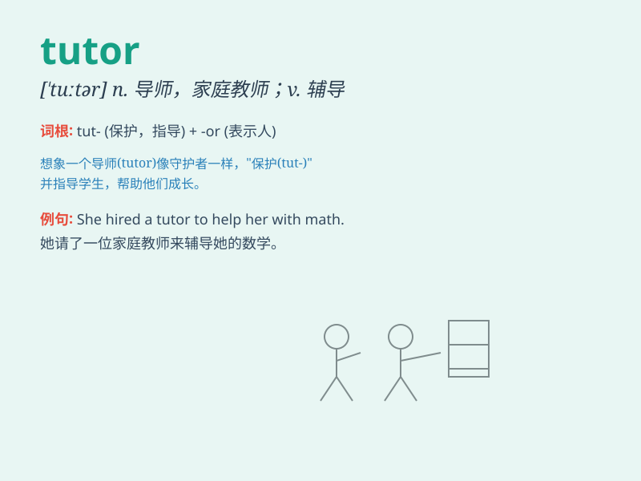

## tutor

**英音:** _[\'tjuːtə]_ **美音:** _[\'tʊtɚ]_

**译义:** *n.家庭教师,(大学)指导教师,助教,监护人,辅导教师v.辅导*

### 短语

+ **private tutor:** _私人教师_

+ **home tutor:** _家庭教师_

+ **tutor system:** _导师制_

+ **tutor student:** _辅导学生_

+ **qualified tutor:** _合格的导师_

### 例句

#### 例句1

> **She hired a tutor to help her with math.**

**中文翻译:** 她雇了一位家庭教师来帮助她学习数学。

**单词释义:** 家庭教师；私人教师

#### 例句2

> **The professor tutors students in history.**

**中文翻译:** 这位教授辅导学生学习历史。

**单词释义:** 辅导；指导

#### 例句3

> **He tutored me in English before the exam.**

**中文翻译:** 在考试前他辅导我的英语。

**单词释义:** 担任......的教师；指导

### 背诵小故事

> 小明学习成绩不好，父母给他请了一位 tutor（家庭教师）。这位 tutor
非常耐心，每天都辅导小明做作业，还帮他制定学习计划。在 tutor
的帮助下，小明的成绩逐渐提高。

**小明学习差，父母请了一位非常耐心的家庭教师辅导他做作业和制定计划，小明成绩变好。**

### 图义

