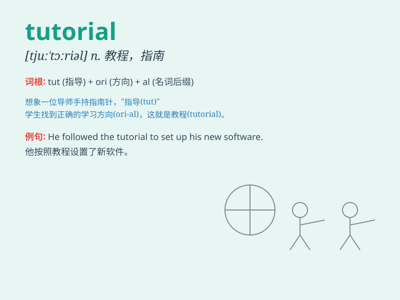

## tutorial

**英音:** _[tjuː\'tɔːrɪəl]_ **美音:** _[tu\'tɔrɪəl]_

**译义:** *n.指南*

### 短语

+ **tutorial class:** _辅导课_

+ **tutorial system:** _导师制_

+ **tutorial center:** _辅导中心_

+ **tutorial session:** _辅导课程_

+ **online tutorial:** _在线教程_

### 例句

#### 例句1

> **I found the tutorial on programming very helpful.**

**中文翻译:** 我发现关于编程的教程非常有帮助。

**单词释义:** 教程；辅导材料

#### 例句2

> **The professor gave a tutorial on advanced mathematics.**

**中文翻译:** 教授进行了高等数学的辅导课。

**单词释义:** 辅导课；指导课

#### 例句3

> **This software comes with a detailed tutorial for beginners.**

**中文翻译:** 这个软件为初学者配备了详细的教程。

**单词释义:** 教程；使用说明

### 背诵小故事

>
有个学生在学习上遇到困难，老师专门为他准备了一系列的指导课程(tutorial)，耐心讲解知识，帮助他逐步提高。最终，学生在老师的教程帮助下，取得了优异成绩。

**有个学生在学习上遇到困难，老师专门为他准备了一系列的辅导课，耐心讲解知识，帮助他逐步提高。最终，学生在老师的辅导课帮助下，取得了优异成绩。**

### 图义

