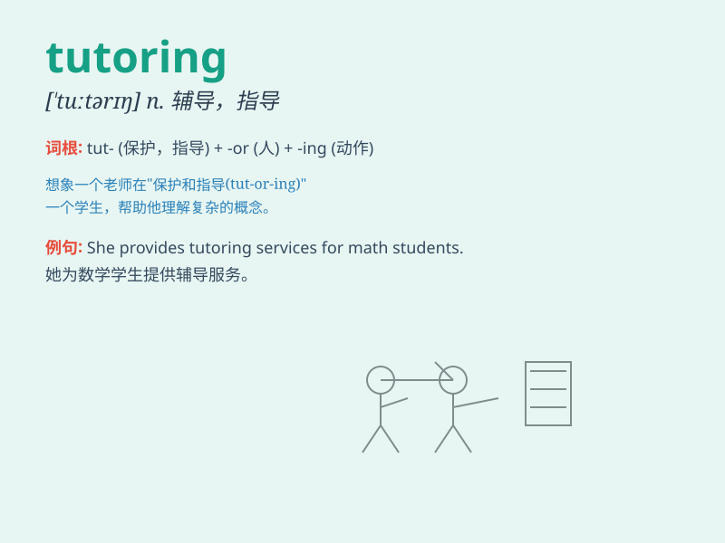

## tutoring

**英音:** _[ˈtjuːtərɪŋ]_ **美音:** _[ˈtuːtərɪŋ]_

**译义:** *n.辅导，指导；教学，讲授*

### 短语

+ **private tutoring:** _私人辅导_

+ **online tutoring:** _在线辅导_

+ **tutoring service:** _辅导服务_

+ **academic tutoring:** _学业辅导_

+ **language tutoring:** _语言辅导_

### 例句

#### 例句1

> **I\'m considering getting tutoring in math to improve my
grades.**

**中文翻译:** 我正在考虑找数学辅导来提高我的成绩。

**单词释义:** 辅导；补习

#### 例句2

> **The tutoring sessions helped him understand the difficult
concepts.**

**中文翻译:** 辅导课程帮助他理解了那些困难的概念。

**单词释义:** 辅导

#### 例句3

> **She makes a living by tutoring students after school.**

**中文翻译:** 她放学后通过辅导学生谋生。

**单词释义:** 辅导（学生）

### 背诵小故事

> Once upon a time, Tom was struggling with math. So, he started
tutoring with a wise teacher. Every day after school, they sat together,
and Tom\'s grades improved. Tutoring really helped him succeed!

**从前，汤姆数学学得很吃力。于是，他开始接受一位睿智老师的辅导。每天放学后，他们坐在一起，汤姆的成绩提高了。辅导真的帮助他取得了成功！**

### 图义

