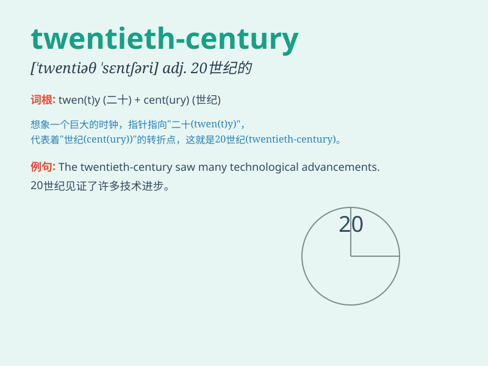

## twentieth-century

**英音:** _[ˈtwentiəθ ˈsentʃəri]_ **美音:** _[ˈtwɛntiəθ
ˈsɛntʃəri]_

**译义:** *adj. 20世纪的；20世纪风格的*

### 短语

+ **twentieth-century art:** _二十世纪的艺术_

+ **twentieth-century literature:** _二十世纪文学_

+ **twentieth-century music:** _二十世纪音乐_

+ **twentieth-century architecture:** _二十世纪建筑_

+ **twentieth-century history:** _二十世纪历史_

### 例句

#### 例句1

> **The art of the twentieth-century was revolutionary and
diverse.**

**中文翻译:** 二十世纪的艺术具有革命性且多种多样。

**单词释义:** 二十世纪的

#### 例句2

> **The twentieth-century witnessed many significant scientific
discoveries.**

**中文翻译:** 二十世纪见证了许多重大的科学发现。

**单词释义:** 二十世纪的

#### 例句3

> **The literature of the twentieth-century reflects the changing
social values.**

**中文翻译:** 二十世纪的文学反映了不断变化的社会价值观。

**单词释义:** 二十世纪的

### 背诵小故事

> In the twentieth-century, a young adventurer traveled through time.
He witnessed great changes, from the first flight to the digital age.
This century was full of wonders and challenges.

**在二十世纪，一位年轻的冒险家进行了时间旅行。他见证了从第一次飞行到数字时代的巨大变化。这个世纪充满了奇迹和挑战。**

### 图义

