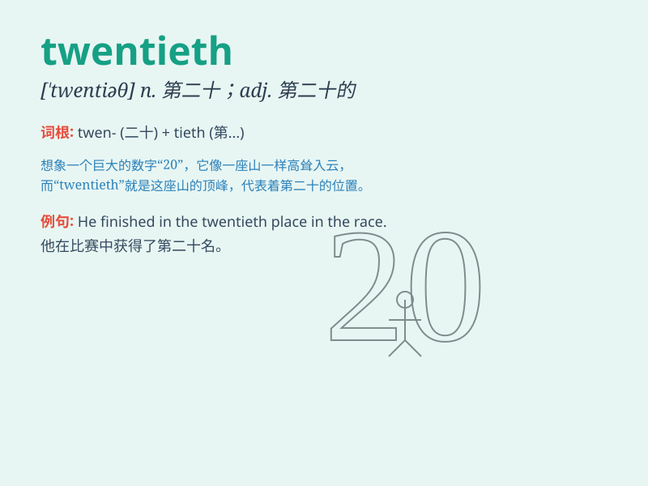

## twentieth

**英音:** _[ˈtwentɪəθ]_ **美音:** _[ˈtwɛntɪɪθ]_

**译义:**
*adj.第二十的,二十分之一的n.第二十(个),二十分之一,(月)的第二十日*

### 短语

+ **the twentieth century:** _二十世纪_

+ **twentieth birthday:** _二十岁生日_

+ **twentieth anniversary:** _二十周年纪念日_

+ **the twentieth floor:** _二十楼_

+ **in the twentieth place:** _处于第二十位_

### 例句

#### 例句1

> **He ranked twentieth in the competition.**

**中文翻译:** 他在比赛中排名第二十。

**单词释义:** 第二十

#### 例句2

> **This is my twentieth birthday.**

**中文翻译:** 这是我的二十岁生日。

**单词释义:** 第二十

#### 例句3

> **The twentieth chapter of this book is very interesting.**

**中文翻译:** 这本书的第二十章非常有趣。

**单词释义:** 第二十

### 背诵小故事

> One day, a little mouse was looking for food. It was its twentieth
adventure. It finally found a big piece of cheese and was very happy. It
knew that perseverance pays off.

**有一天，一只小老鼠在寻找食物。这是它的第二十次冒险。它终于找到了一大块奶酪，非常高兴。它知道坚持就有回报。**

### 图义

