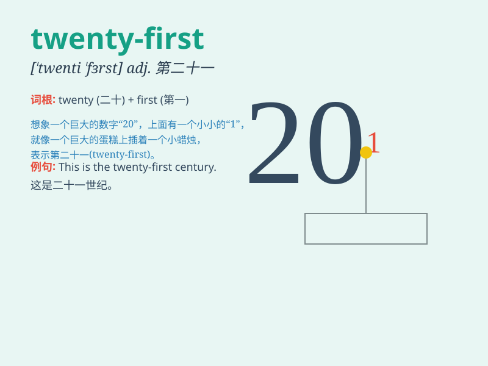

## twenty-first

**英音:** _[ˈtwɛnti ˈfɜːst]_ **美音:** _[ˈtwen.ti
ˈfɜrst]_

**译义:** *序数词，表示第二十一的*

### 短语

+ **the twenty-first century:** _二十一世纪_

+ **twenty-first birthday:** _二十一岁生日_

+ **the twenty-first floor:** _二十一楼_

+ **twenty-first of May:** _五月二十一日_

+ **in the twenty-first year:** _在第二十一年_

### 例句

#### 例句1

> **The twenty-first of this month is my birthday.**

**中文翻译:** 这个月的二十一号是我的生日。

**单词释义:** 第二十一

#### 例句2

> **She won the race in the twenty-first minute.**

**中文翻译:** 她在第二十一分钟赢得了比赛。

**单词释义:** 第二十一

#### 例句3

> **The twenty-first chapter of this book is very interesting.**

**中文翻译:** 这本书的第二十一章非常有趣。

**单词释义:** 第二十一

### 背诵小故事

> One day, a little rabbit was celebrating its twenty-first birthday.
It had a big party with all its friends. They ate cakes and had a lot of
fun. The number twenty-first marked a special day for the rabbit.

**有一天，一只小兔子正在庆祝它的二十一岁生日。它和所有朋友举办了一个盛大的派对。它们吃蛋糕，玩得非常开心。数字二十一为兔子标记了一个特别的日子。**

### 图义

