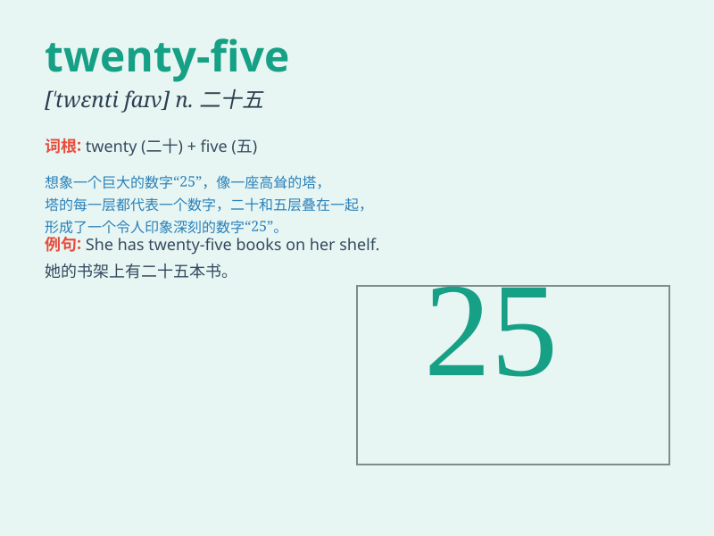

## twenty-five

**英音:** _[ˈtwentɪ-faɪv]_ **美音:** _[ˈtwen.ti.fajv]_

**译义:** *数词。意为\'二十五\'，用于表示数量或序列中的第二十五个*

### 短语

+ **twenty-five years old:** _二十五岁_

+ **twenty-five dollars:** _二十五美元_

+ **twenty-five minutes:** _二十五分钟_

+ **twenty-five students:** _二十五名学生_

+ **twenty-five kilometers:** _二十五公里_

### 例句

#### 例句1

> **I have twenty-five apples in my basket.**

**中文翻译:** 我的篮子里有二十五个苹果。

**单词释义:** 二十五

#### 例句2

> **The book costs twenty-five dollars.**

**中文翻译:** 这本书花费二十五美元。

**单词释义:** 二十五

#### 例句3

> **She is twenty-five years old.**

**中文翻译:** 她二十五岁了。

**单词释义:** 二十五

### 背诵小故事

> One day, I needed twenty-five apples for a big party. I went to the
store and counted carefully to make sure I got exactly twenty-five. It
was a fun and challenging task!

**有一天，我为一个大型聚会需要二十五个苹果。我去了商店，仔细地数着以确保我正好拿到二十五个。这是一项有趣又有挑战的任务！**

### 图义

