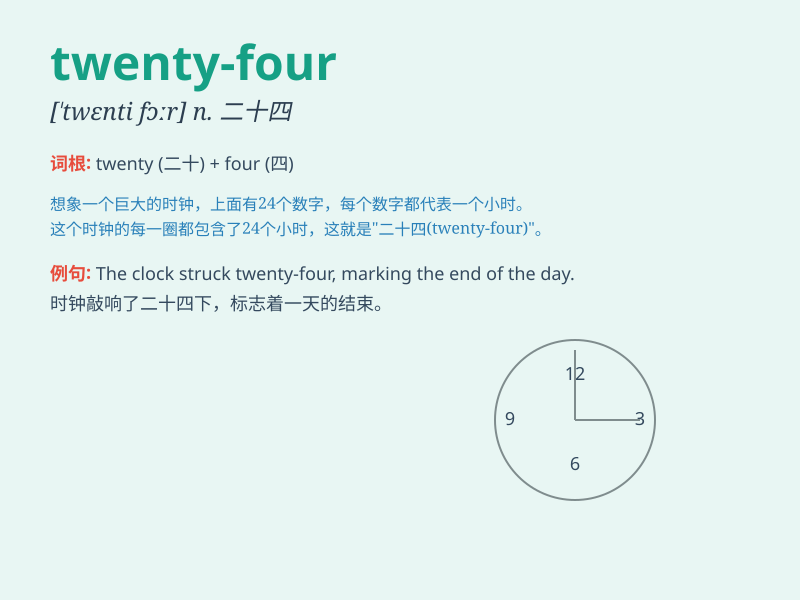

## twenty-four

**英音:** _[ˈtwenti fɔː(r)]_ **美音:** _[ˈtwenti fɔːr]_

**译义:** *二十四*

### 短语

+ **twenty-four hours:** _二十四小时_

+ **twenty-four seven:** _每时每刻；一直；不分昼夜_

+ **twenty-four carat:** _二十四开（纯金）_

+ **twenty-fourth:** _第二十四_

+ **twenty-fourfold:** _二十四倍的_

### 例句

#### 例句1

> **I wake up at twenty-four past six every morning.**

**中文翻译:** 我每天早上六点二十四分醒来。

**单词释义:** 表示时间，六点二十四分

#### 例句2

> **The temperature is twenty-four degrees Celsius today.**

**中文翻译:** 今天的温度是二十四摄氏度。

**单词释义:** 表示温度，二十四度

#### 例句3

> **There are twenty-four students in our class.**

**中文翻译:** 我们班有二十四名学生。

**单词释义:** 表示数量，二十四

### 背诵小故事

> One day, I was looking at the clock and it showed twenty-four minutes
past the hour. I thought about how twenty-four hours make a whole day.
It\'s such a special number.

**有一天，我看着时钟，它显示过了二十四分钟。我想到二十四小时构成一整天。这是一个如此特别的数字。**

### 图义

