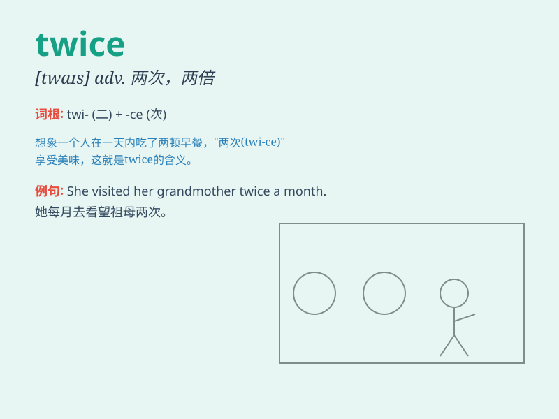

## twice

**英音:** _[twaɪs]_ **美音:** _[twaɪs]_

**译义:** *adv.两次,两倍*

### 短语

+ **twice a week:** _一周两次_

+ **twice as much:** _两倍之多_

+ **twice over:** _两倍；再次_

+ **think twice:** _再三考虑；重新考虑_

+ **twice or thrice:** _两三次_

### 例句

#### 例句1

> **I go swimming twice a week.**

**中文翻译:** 我每周去游泳两次。

**单词释义:** 两次

#### 例句2

> **She has been to Paris twice.**

**中文翻译:** 她去过巴黎两次。

**单词释义:** 两次

#### 例句3

> **You should check your work twice before submitting it.**

**中文翻译:** 在提交之前，你应该检查你的工作两次。

**单词释义:** 两次

### 背诵小故事

> One day, a little rabbit was lost. It needed to cross a river twice
to find its way home. First, it swam across but went the wrong way.
Then, it swam back and crossed again successfully. \'Twice\' means two
times.

**有一天，一只小兔子迷路了。它需要过河两次才能找到回家的路。第一次，它游过去了但走错了方向。然后，它又游回来并再次成功过河。'twice'意思是两次。**

### 图义

