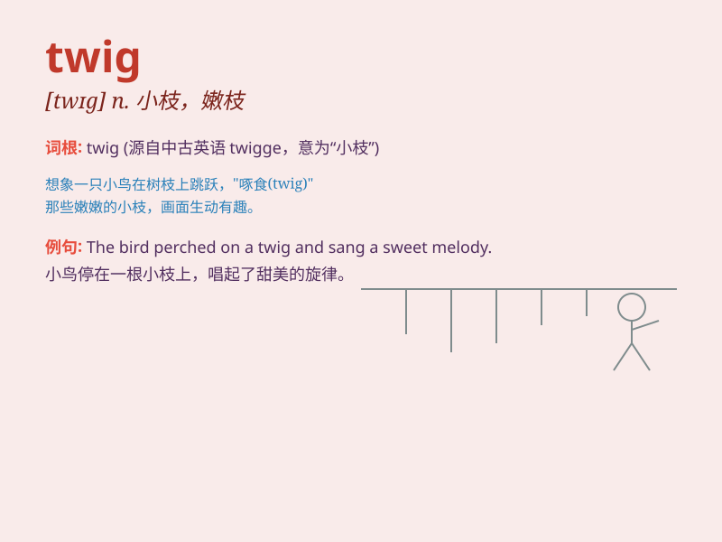

## twig

**英音:** _[twɪg]_ **美音:** _[twɪɡ]_

**译义:** *n.嫩枝,小枝,末梢v.注意,了解*

### 短语

+ **twig something:** _理解某事；明白某事_

+ **in the twig:** _在初期；在萌芽阶段_

+ **twig off:** _突然折断；突然脱落_

+ **thin as a twig:** _像树枝一样瘦_

+ **twig the difference:** _察觉差异；看出不同_

### 例句

#### 例句1

> **The bird landed on a twig.**

**中文翻译:** 这只鸟落在了一根小树枝上。

**单词释义:** 小树枝

#### 例句2

> **She broke a twig from the tree.**

**中文翻译:** 她从树上折下了一根小树枝。

**单词释义:** 小树枝

#### 例句3

> **The twig snapped under his weight.**

**中文翻译:** 那根小树枝在他的重压下折断了。

**单词释义:** 小树枝

### 背诵小故事

> A little bird was building its nest. It needed some twigs. So, it
flew around and finally found the perfect twigs. With them, it made a
cozy home. Remember, a twig is a small thin branch.

**一只小鸟正在筑巢。它需要一些细枝。于是，它飞来飞去，最终找到了完美的细枝。用它们，它建造了一个舒适的家。记住，twig
就是小而细的树枝。**

### 图义

