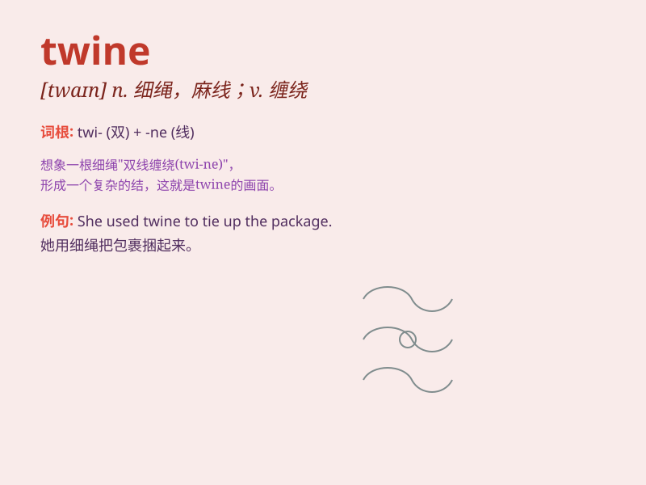

## twine

**英音:** _[twaɪn]_ **美音:** _[twaɪn]_

**译义:** *n.合股线,细绳,麻线,搓v.搓,织,编饰,(使)缠绕*

### 短语

+ **twine around:** _缠绕；围绕_

+ **twine together:** _交织在一起_

+ **twine into:** _编成；织成_

+ **twine sth. tightly:** _把某物紧紧缠绕_

+ **twine of rope:** _绳索的股线_

### 例句

#### 例句1

> **She used twine to tie the package.**

**中文翻译:** 她用麻线捆包裹。

**单词释义:** 麻线；细绳

#### 例句2

> **The vines twined around the pole.**

**中文翻译:** 藤蔓缠绕在杆子上。

**单词释义:** （使）缠绕；（使）盘绕

#### 例句3

> **The path twined through the forest.**

**中文翻译:** 小路蜿蜒穿过森林。

**单词释义:** 蜿蜒；曲折前行

### 背诵小故事

> A little mouse was trying to find a way out of a maze. It found a
piece of twine and followed it, hoping it would lead to the exit.
Finally, the twine did guide the mouse to freedom.

**一只小老鼠试图找到走出迷宫的路。它发现了一根细绳，就顺着它走，希望它能通向出口。最后，这根细绳确实引导老鼠获得了自由。**

### 图义

