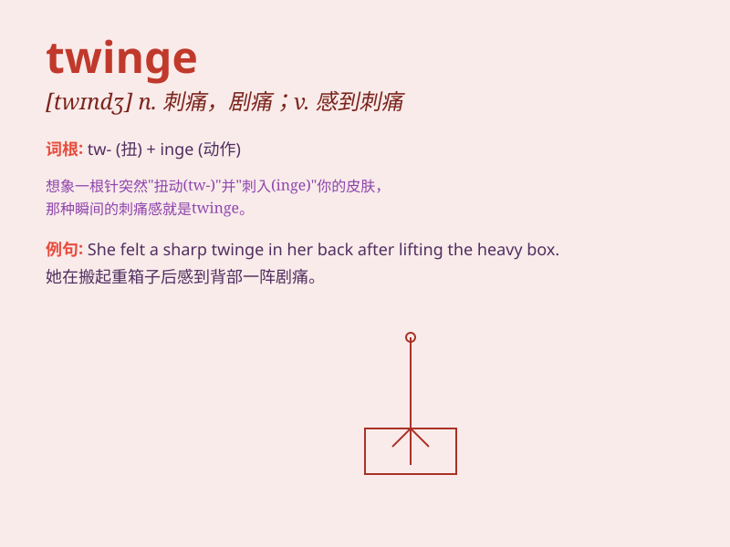

## twinge

**英音:** _[twɪn(d)ʒ]_ **美音:** _[twɪndʒ]_

**译义:**
*n.一阵一阵痛,如刺一样痛,剧痛vt.使一阵一阵痛,刺痛vt.感到剧痛,刺痛*

### 短语

+ **a twinge of pain:** _一阵疼痛_

+ **a twinge of conscience:** _一阵良心的谴责_

+ **a twinge of jealousy:** _一阵嫉妒_

+ **a twinge of sadness:** _一阵悲伤_

+ **a twinge of remorse:** _一阵懊悔_

### 例句

#### 例句1

> **I felt a twinge of pain in my knee when I climbed the stairs.**

**中文翻译:** 当我爬楼梯时，我的膝盖感到一阵疼痛。

**单词释义:** 一阵疼痛

#### 例句2

> **A twinge of guilt passed through her as she thought of her
lie.**

**中文翻译:** 当她想到自己的谎言时，一阵内疚掠过她的心头。

**单词释义:** 一阵（内疚等）情感

#### 例句3

> **He experienced a twinge of sadness at the thought of leaving his
hometown.**

**中文翻译:** 一想到要离开家乡，他感到一阵悲伤。

**单词释义:** 一阵（悲伤等）情感

### 背诵小故事

> One day, I was playing basketball and suddenly felt a twinge in my
leg. It was a sharp and brief pain. Later I realized I had pulled a
muscle. The twinge reminded me to be more careful during sports.

**有一天，我正在打篮球，突然腿部感到一阵刺痛。这是一种尖锐而短暂的疼痛。后来我意识到我拉伤了肌肉。这阵刺痛提醒我在运动时要更小心。**

### 图义

