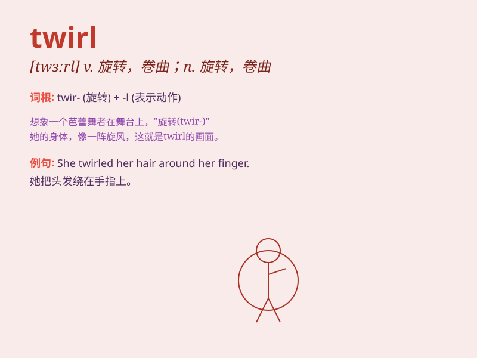

## twirl

**英音:** _[twɜːl]_ **美音:** _[twɝl]_

**译义:**
*vt.(使)快速转动,捻弄vi.转动,旋转n.转动,万能钥匙,旋转的东西*

### 短语

+ **twirl around:** _旋转；转动_

+ **twirl something in one\'s hand:** _在手中转动某物_

+ **twirl gracefully:** _优美地旋转_

+ **twirl the baton:** _转动指挥棒_

+ **twirl with joy:** _高兴地旋转_

### 例句

#### 例句1

> **She twirled around in her new dress, looking happy.**

**中文翻译:** 她穿着新裙子旋转，看起来很开心。

**单词释义:** 旋转

#### 例句2

> **The dancer twirled gracefully on the stage.**

**中文翻译:** 舞者在舞台上优雅地旋转。

**单词释义:** 旋转

#### 例句3

> **He twirled his pen between his fingers while thinking.**

**中文翻译:** 他思考时在手指间转动他的笔。

**单词释义:** 转动

### 背诵小故事

> A little girl was twirling happily on the stage. She wore a beautiful
dress and her hair was twirling along with her. The audience were all
charmed by her twirling performance.

**一个小女孩在舞台上欢快地旋转。她穿着漂亮的裙子，头发也随着她一起旋转。观众都被她的旋转表演吸引住了。**

### 图义

