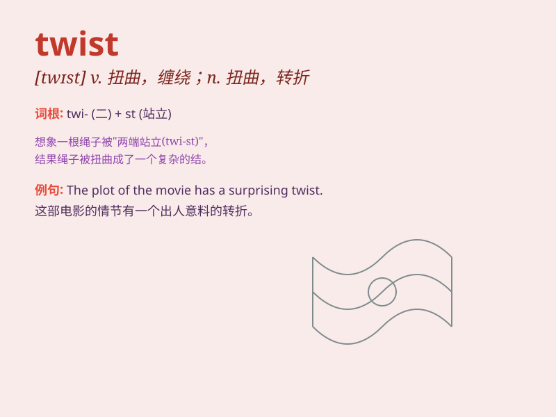

## twist

**英音:** _[twɪst]_ **美音:** _[twɪst]_

**译义:**
*n.一扭,扭曲,盘旋,曲折,歪曲,手法,螺旋状vt.拧,扭曲,绞,搓,捻,使苦恼,使转动,编织vi.扭弯,扭曲,缠绕,扭动,呈螺旋形*

### 短语

+ **twist and turn:** _迂回曲折_

+ **twist someone\'s arm:** _强迫某人做某事_

+ **give a twist:** _使改变；使扭曲_

+ **mental twist:** _心理扭曲_

+ **twist of fate:** _命运的转折_

### 例句

#### 例句1

> **She gave the rope a twist.**

**中文翻译:** 她把绳子扭了一下。

**单词释义:** 扭；拧

#### 例句2

> **The story has taken a strange twist.**

**中文翻译:** 故事发生了奇特的转折。

**单词释义:** 转折；转变

#### 例句3

> **The path twisted through the forest.**

**中文翻译:** 小路蜿蜒穿过森林。

**单词释义:** 蜿蜒；曲折

### 背诵小故事

> One day, while walking in the park, I saw a little girl twisting a
ribbon beautifully. She made various shapes with it. The ribbon\'s twist
was like a magic dance.

**有一天，在公园散步时，我看到一个小女孩漂亮地扭转着一条丝带。她用它做出了各种各样的形状。丝带的扭转就像一场神奇的舞蹈。**

### 图义

