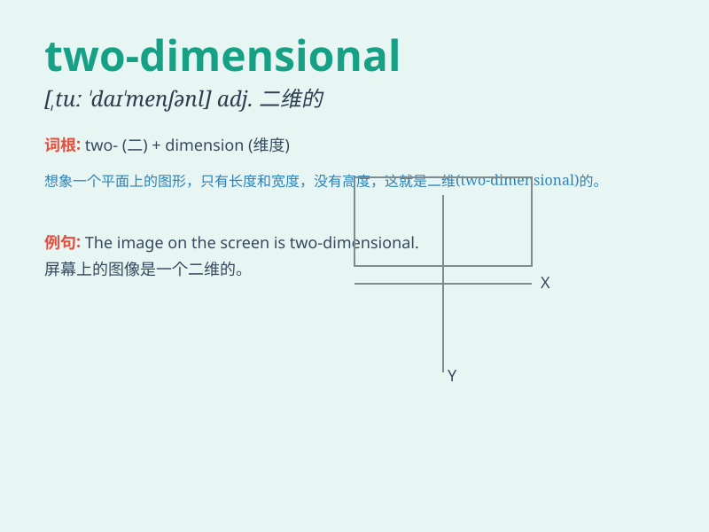

## two-dimensional

**英音:** _[tuː daɪˈmenʃənl]_ **美音:** _[tu
daɪˈmenʃənl]_

**译义:** *adj.二维的；平面的*

### 短语

+ **two-dimensional space:** _二维空间_

+ **two-dimensional figure:** _二维图形_

+ **two-dimensional design:** _二维设计_

+ **two-dimensional image:** _二维图像_

+ **two-dimensional model:** _二维模型_

### 例句

#### 例句1

> **The artist created a two-dimensional painting of a landscape.**

**中文翻译:** 这位艺术家创作了一幅二维的风景画。

**单词释义:** 二维的

#### 例句2

> **The computer simulation presented a two-dimensional model of the
molecule.**

**中文翻译:** 计算机模拟展示了这个分子的二维模型。

**单词释义:** 二维的

#### 例句3

> **The game has simple two-dimensional graphics.**

**中文翻译:** 这个游戏有简单的二维图形。

**单词释义:** 二维的

### 背诵小故事

> Once upon a time, there was a magical square. It could only move in
two directions, left and right. This made it two-dimensional. It was
like a flat character in a story, having only two possible paths.

**从前，有一个神奇的正方形。它只能朝两个方向移动，左和右。这使它是二维的。它就像故事中一个扁平的角色，只有两条可能的路径。**

### 图义

