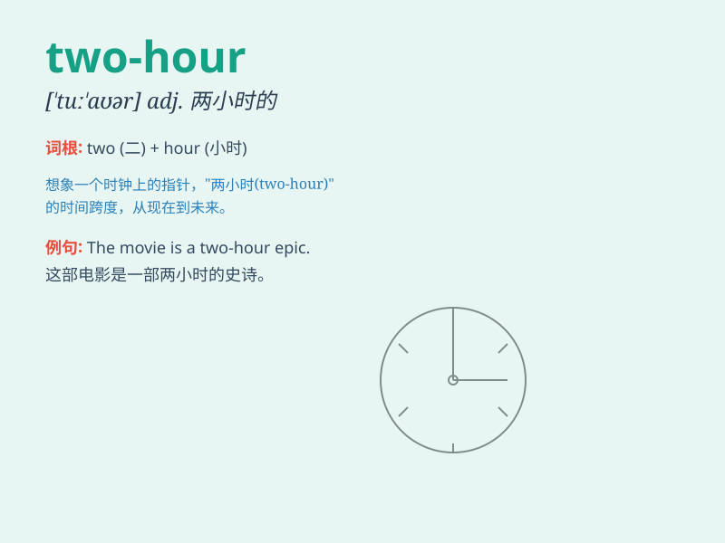

## two-hour

**英音:** _[tuː ˈaʊə]_ **美音:** _[tu ˈaʊər]_

**译义:** *adj. 两小时的；持续两小时的*

### 短语

+ **two-hour journey:** _两小时的旅程_

+ **two-hour meeting:** _两小时的会议_

+ **two-hour delay:** _两小时的延误_

+ **two-hour break:** _两小时的休息_

+ **two-hour lecture:** _两小时的讲座_

### 例句

#### 例句1

> **The two-hour meeting was very productive.**

**中文翻译:** 这个两小时的会议非常有成效。

**单词释义:** 两小时的（用于修饰名词 meeting，表示会议的时长）

#### 例句2

> **We have a two-hour break between classes.**

**中文翻译:** 我们课间有两个小时的休息时间。

**单词释义:** 两小时的（修饰 break，表示休息的时长）

#### 例句3

> **The two-hour journey was quite tiring.**

**中文翻译:** 这两小时的旅程相当累人。

**单词释义:** 两小时的（修饰 journey，表示旅程的时长）

### 背诵小故事

> Imagine a race where you have to run for two hours. The timer is set
for exactly \'two-hour\'. It\'s a long and challenging time, but you
keep going. So, \'two-hour\' means a period of two hours.

**想象一场赛跑，你必须跑两个小时。计时器设定的时间正好是"两个小时"。这是一段漫长而具有挑战性的时间，但你一直在坚持。所以，"two-hour"意思是两小时的时间段。**

### 图义

