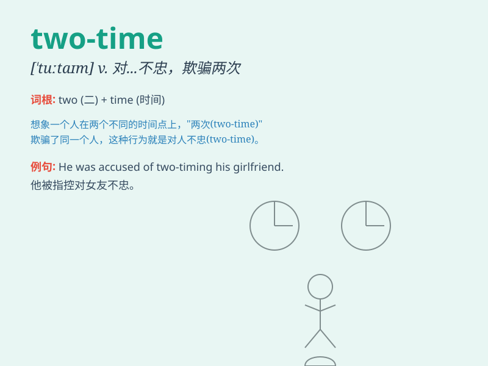

## two-time

**英音:** _[ˈtuː.taim]_ **美音:** _[ˈtuː.taɪm]_

**译义:** *adj. 不忠的；骗人的；n. 变心的情人；骗子；例：He\'s
nothing but a two-time liar. 他不过是个反复无常的骗子。*

### 短语

+ **two-time lover:** _脚踏两条船的情人_

+ **two-time friend:** _不忠实的朋友_

+ **two-time cheater:** _惯于欺骗感情的人_

+ **two-time partner:** _不忠的伴侣_

+ **two-time offender:** _屡次出轨者_

### 例句

#### 例句1

> **He was accused of two-timing his girlfriend with another
woman.**

**中文翻译:** 他被指控背着女友和另一个女人劈腿。

**单词释义:** 对（情人或爱人）不忠

#### 例句2

> **Don\'t two-time me or I\'ll never trust you again.**

**中文翻译:** 别对我不忠，否则我再也不会信任你了。

**单词释义:** 欺骗，背叛（恋人）

#### 例句3

> **She found out that her husband was two-timing her and filed for
divorce.**

**中文翻译:** 她发现丈夫对她不忠，于是提出了离婚。

**单词释义:** 脚踏两条船

### 背诵小故事

> Once upon a time, there was a man who had two girlfriends. He was
two-timing them, being unfaithful. This made both girls very sad.
Remember, two-time means to deceive or be unfaithful to a lover.

**从前，有个男人有两个女朋友。他对她们脚踏两条船，不忠。这让两个女孩都很伤心。记住，two-time
意思是对爱人不忠或欺骗。**

### 图义

