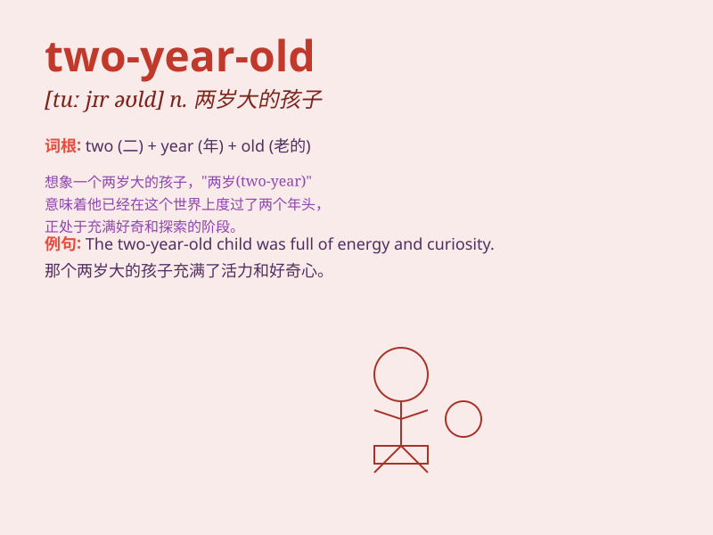

## two-year-old

**英音:** _[ˈtuː ˈjɪər ˌoʊld]_ **美音:** _[ˈtu ˈjer
ˌoʊld]_

**译义:** *形容词，意思是两岁的，通常用于描述年龄为两岁的人或事物*

### 短语

+ **two-year-old boy:** _两岁的男孩_

+ **two-year-old girl:** _两岁的女孩_

+ **two-year-old dog:** _两岁的狗_

+ **two-year-old cat:** _两岁的猫_

+ **two-year-old plant:** _两岁的植物_

### 例句

#### 例句1

> **The two-year-old boy is very cute.**

**中文翻译:** 这个两岁的男孩非常可爱。

**单词释义:** 两岁的（形容男孩的年龄）

#### 例句2

> **She has a two-year-old daughter.**

**中文翻译:** 她有一个两岁的女儿。

**单词释义:** 两岁的（形容女儿的年龄）

#### 例句3

> **The two-year-old cat likes to sleep all day.**

**中文翻译:** 这只两岁的猫喜欢整天睡觉。

**单词释义:** 两岁的（形容猫的年龄）

### 背诵小故事

> There was a cute two-year-old boy. He loved playing with his toy car.
One day, he lost it but found it under the sofa. His smile came back. He
was such a charming little fellow!

**有一个可爱的两岁小男孩。他喜欢玩他的玩具车。有一天，他弄丢了它，但在沙发下找到了。他的笑容又回来了。他真是个迷人的小家伙！**

### 图义

