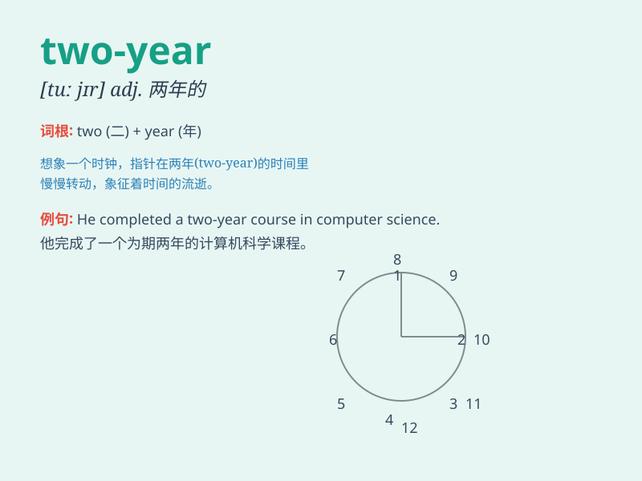

## two-year

**英音:** _[tuː jɪə]_ **美音:** _[tu jɪr]_

**译义:** *adj.两岁的；持续两年的*

### 短语

+ **two-year-old:** _两岁的_

+ **two-year period:** _两年的时期_

+ **two-year plan:** _两年计划_

+ **two-year warranty:** _两年保修_

+ **two-year course:** _两年的课程_

### 例句

#### 例句1

> **The two-year project was finally completed successfully.**

**中文翻译:** 这个为期两年的项目终于成功完成了。

**单词释义:** 为期两年的

#### 例句2

> **She signed a two-year contract with the company.**

**中文翻译:** 她和公司签了一份为期两年的合同。

**单词释义:** 为期两年的

#### 例句3

> **The two-year course is very challenging.**

**中文翻译:** 这门为期两年的课程非常具有挑战性。

**单词释义:** 为期两年的

### 背诵小故事

> A little rabbit had a two-year adventure. It traveled through forests
and mountains. During these two years, it saw many beautiful scenes and
made many friends. Two-year means lasting for two years.

**一只小兔子有一个为期两年的冒险。它穿越森林和山脉。在这两年里，它看到了许多美丽的景色并结交了许多朋友。two-year
意思是持续两年的。**

### 图义

