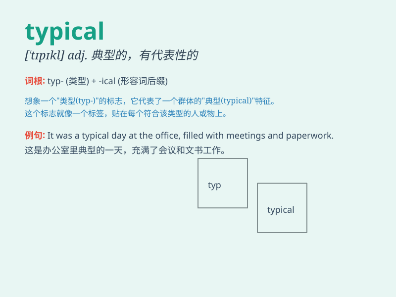

## typical

**英音:** _[\'tɪpɪk(ə)l]_ **美音:** _[\'tɪpɪkl]_

**译义:** *adj.典型的,象征性的*

### 短语

+ **typical example:** _典型例子_

+ **typical feature:** _典型特征_

+ **typical mistake:** _典型错误_

+ **typical case:** _典型案例_

+ **typical behavior:** _典型行为_

### 例句

#### 例句1

> **This is a typical example of his work.**

**中文翻译:** 这是他工作的一个典型例子。

**单词释义:** 典型的；有代表性的

#### 例句2

> **It\'s typical of him to be late.**

**中文翻译:** 他迟到是常有的事。

**单词释义:** 一贯的；平常的

#### 例句3

> **The typical family has two children.**

**中文翻译:** 典型的家庭有两个孩子。

**单词释义:** 典型的；有代表性的

### 背诵小故事

> A typical day for Tom starts with a cup of coffee and a newspaper. He
then goes for a jog, has a simple lunch, and works in the garden. This
shows what a usual and representative day is like for him.

**对于汤姆来说，典型的一天从一杯咖啡和一份报纸开始。然后他去慢跑，吃一顿简单的午餐，在花园里工作。这展示了他平常且有代表性的一天。**

### 图义

