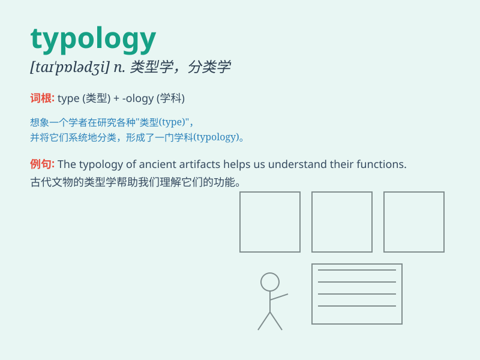

## typology

**英音:** _[taɪ\'pɒlədʒɪ]_ **美音:** _[taɪ\'pɑlədʒi]_

**译义:** *n.类型学,血型学,体型学,象征学*

### 短语

+ **typology of language:** _语言类型学_

+ **cultural typology:** _文化类型学_

+ **architectural typology:** _建筑类型学_

+ **personality typology:** _人格类型学_

+ **linguistic typology:** _语言类型学_

### 例句

#### 例句1

> **The typology of ancient buildings can provide valuable insights
into history.**

**中文翻译:** 古建筑的类型学可以为历史提供有价值的见解。

**单词释义:** 类型学

#### 例句2

> **This book explores the typology of different cultures.**

**中文翻译:** 这本书探讨了不同文化的类型。

**单词释义:** 类型

#### 例句3

> **The typology of crimes has changed over the years.**

**中文翻译:** 犯罪的类型多年来已经发生了变化。

**单词释义:** 类型

### 背诵小故事

> A detective was studying typology to classify criminals. He found
that certain criminal types had similar traits. By understanding
typology, he could predict criminal behavior and solve cases more
easily.

**一位侦探正在研究类型学以对罪犯进行分类。他发现某些犯罪类型具有相似的特征。通过理解类型学，他能够更轻松地预测犯罪行为并破案。**

### 图义

