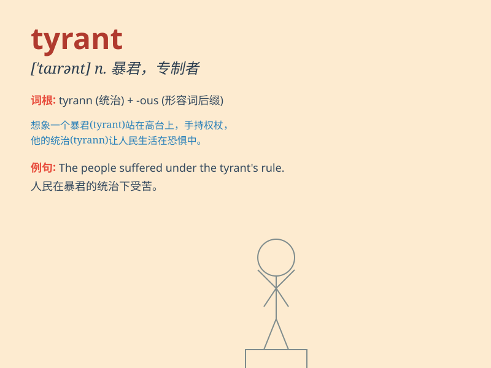

## tyrant

**英音:** _[\'taɪr(ə)nt]_ **美音:** _[\'taɪrənt]_

**译义:** *n.暴君*

### 短语

+ **tyrant rule:** _暴君统治_

+ **despotic tyrant:** _专制暴君_

+ **tyrant king:** _暴君国王_

+ **cruel tyrant:** _残忍的暴君_

+ **power-hungry tyrant:** _渴望权力的暴君_

### 例句

#### 例句1

> **The tyrant ruled the country with an iron fist.**

**中文翻译:** 这个暴君用铁腕统治着这个国家。

**单词释义:** 暴君

#### 例句2

> **He was seen as a tyrant by the oppressed people.**

**中文翻译:** 他被受压迫的人民视为暴君。

**单词释义:** 暴君

#### 例句3

> **The company\'s boss was a tyrant who never listened to the
employees\' opinions.**

**中文翻译:** 这家公司的老板是个暴君，从不听取员工的意见。

**单词释义:** 专横的人

### 背诵小故事

> Once upon a time, in a faraway kingdom, there was a cruel leader
called the tyrant. He made people\'s lives miserable, took away their
freedom, and ruled with fear. Everyone hated him.

**从前，在一个遥远的王国，有一个残暴的领导者叫做暴君。他让人们的生活痛苦不堪，夺走了他们的自由，并用恐惧来统治。每个人都讨厌他。**

### 图义

