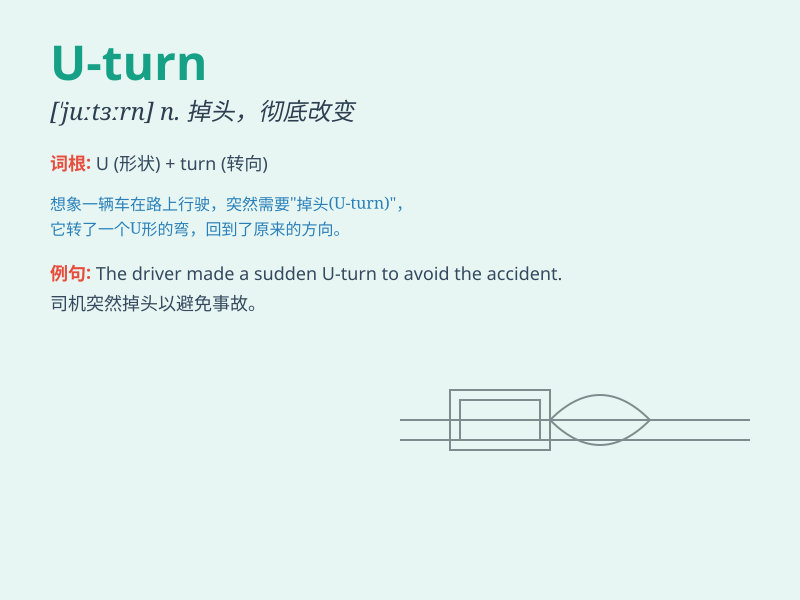

## U-turn

**英音:** _[ˈjuː tɜːn]_ **美音:** _[ˈjuː tɜːrn]_

**译义:** *n.（车辆的）U 形转弯，180
度转弯；（政策、行为等的）彻底转变*

### 短语

+ **make a U-turn:** _做 U 形转弯_

+ **do a U-turn:** _进行 U 形转弯_

+ **executive U-turn:** _政策的大转弯_

+ **sharp U-turn:** _急转弯_

+ **sudden U-turn:** _突然的 U 形转弯_

### 例句

#### 例句1

> **The driver made a U-turn at the intersection.**

**中文翻译:** 这位司机在十字路口做了个 U 形转弯。

**单词释义:** U 形转弯

#### 例句2

> **You can\'t do a U-turn here. It\'s prohibited.**

**中文翻译:** 你不能在这里做 U 形转弯。这是被禁止的。

**单词释义:** U 形转弯

#### 例句3

> **After realizing his mistake, he made a quick U-turn.**

**中文翻译:** 意识到自己的错误后，他迅速做了个 U
形转弯（改变了主意）。

**单词释义:** U 形转弯；（想法、计划等的）彻底改变

### 背诵小故事

> One day, I was driving on a road. Suddenly, I realized I was going
the wrong way. So, I made a U-turn to go back. It was a quick and sharp
change of direction, just like the shape of the letter \'U\'.

**有一天，我在路上开车。突然，我意识到我走错路了。于是，我来了个 U
形转弯往回走。这是一个快速且尖锐的方向改变，就像字母\'U\'的形状。**

### 图义

