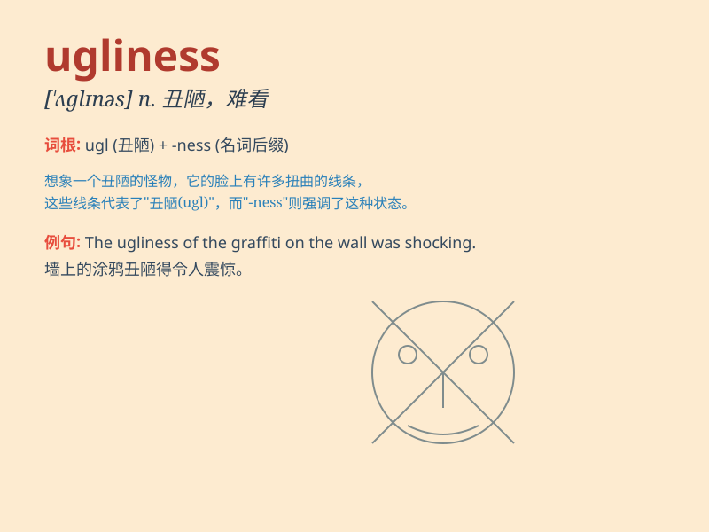

## ugliness

**英音:** _[ˈʌglɪnɪs]_ **美音:** _[ˈʌglinəs]_

**译义:** *n.丑陋*

### 短语

+ **the ugliness of war:** _战争的丑恶_

+ **ugliness and beauty:** _丑与美_

+ **inner ugliness:** _内在的丑陋_

+ **reveal the ugliness:** _揭露丑恶_

+ **ugliness of character:** _性格的丑陋_

### 例句

#### 例句1

> **The ugliness of war left a deep scar on the country.**

**中文翻译:** 战争的丑恶给这个国家留下了深深的创伤。

**单词释义:** 丑恶；丑陋

#### 例句2

> **He couldn\'t bear the ugliness of her behavior.**

**中文翻译:** 他无法忍受她行为的丑陋。

**单词释义:** 丑陋；恶劣

#### 例句3

> **Despite the ugliness of the situation, she remained
optimistic.**

**中文翻译:** 尽管情况糟糕，她仍然保持乐观。

**单词释义:** 糟糕；恶劣

### 背诵小故事

> Once upon a time, in a faraway land, there was a monster known for
its ugliness. Everyone was scared of it. But later, people learned that
true beauty lies within. The monster\'s ugliness was just on the
surface.

**从前，在一个遥远的地方，有一只以丑陋著称的怪物。每个人都害怕它。但后来，人们明白了真正的美在于内心。怪物的丑陋只是表面的。**

### 图义

