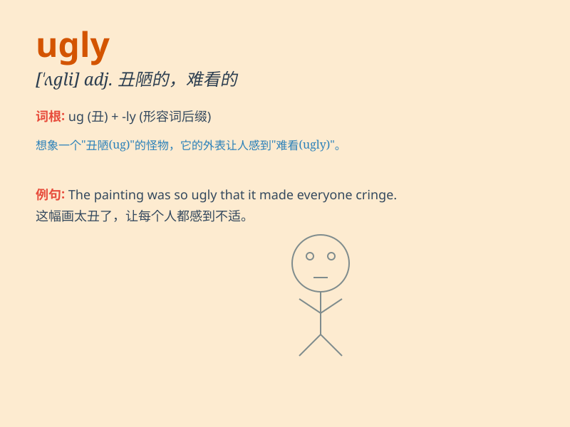

## ugly

**英音:** _[\'ʌglɪ]_ **美音:** _[\'ʌɡli]_

**译义:** *adj.丑陋的,难看的*

### 短语

+ **ugly duckling:** _丑小鸭；初时不引人注目后来却成功的人或事物_

+ **ugly customer:** _难对付的家伙_

+ **ugly scene:** _令人不快的场面_

+ **ugly mood:** _坏心情_

+ **ugly rumor:** _恶意的谣言_

### 例句

#### 例句1

> **The old house looked ugly and rundown.**

**中文翻译:** 这座旧房子看起来又丑又破败。

**单词释义:** 丑的；难看的

#### 例句2

> **She has an ugly temper.**

**中文翻译:** 她脾气很坏。

**单词释义:** 恶劣的；坏的

#### 例句3

> **The situation turned ugly when the two groups started
arguing.**

**中文翻译:** 当两组人开始争吵时，情况变得糟糕了。

**单词释义:** 糟糕的；令人不愉快的

### 背诵小故事

> Once upon a time, there was an ugly monster. It had a big head, small
eyes, and a crooked nose. Everyone was scared of it. But later, we
learned that looks don\'t matter, and kindness is what counts.

**从前，有一只丑陋的怪物。它有一个大头，小眼睛和一个歪鼻子。每个人都害怕它。但后来，我们知道了外表不重要，善良才重要。**

### 图义

