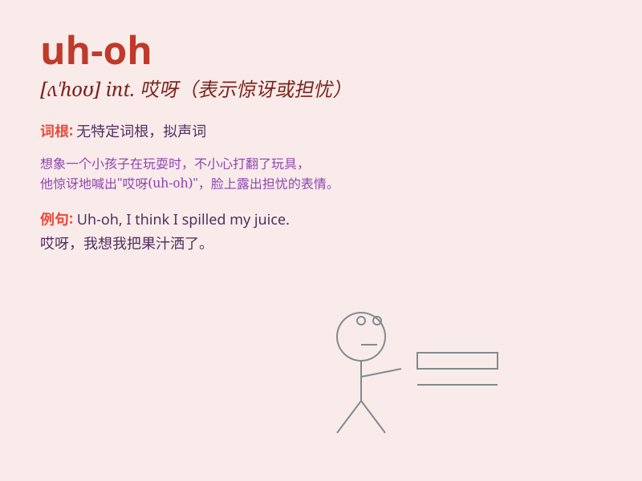

## uh-oh

**英音:** _[ʌˈhoʊ]_ **美音:** _[ʌˈhoʊ]_

**译义:** *int.（表示惊讶、担忧、失望等）哎呀，啊呀*

### 短语

+ **uh-oh moment:** _糟糕的时刻_

+ **say uh-oh:** _说哎呀_

+ **an uh-oh situation:** _一个糟糕的情况_

+ **uh-oh expression:** _哎呀的表情_

+ **feel uh-oh:** _感觉不妙_

### 例句

#### 例句1

> **Uh-oh, I think I forgot my keys.**

**中文翻译:** 哎呀，我想我忘了带钥匙。

**单词释义:** 表示突然意识到不好的情况

#### 例句2

> **Uh-oh, the cake is burning!**

**中文翻译:** 哎呀，蛋糕烤糊了！

**单词释义:** 用于表达意外或糟糕的事情正在发生

#### 例句3

> **Uh-oh, we\'re going to be late for the movie.**

**中文翻译:** 哎呀，我们看电影要迟到了。

**单词释义:** 表示对即将发生的不良后果的警觉

### 背诵小故事

> One day, Tom was climbing a tree. Suddenly, a branch broke and he
started to fall. At that moment, he shouted \'Uh-oh!\' which means he
realized something bad was about to happen.

**有一天，汤姆正在爬树。突然，一根树枝断了，他开始往下掉。就在那时，他喊出了\'uh-oh!\'，这意味着他意识到不好的事情即将发生。**

### 图义

