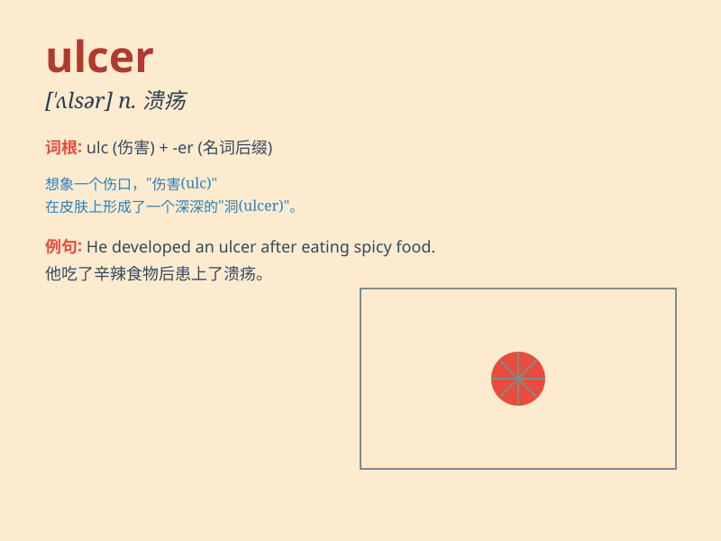

## ulcer

**英音:** _[\'ʌlsə]_ **美音:** _[\'ʌlsɚ]_

**译义:** *n.溃疡,腐烂物*

### 短语

+ **gastric ulcer:** _胃溃疡_

+ **duodenal ulcer:** _十二指肠溃疡_

+ **skin ulcer:** _皮肤溃疡_

+ **oral ulcer:** _口腔溃疡_

+ **chronic ulcer:** _慢性溃疡_

### 例句

#### 例句1

> **The ulcer on his leg was very painful.**

**中文翻译:** 他腿上的溃疡非常疼。

**单词释义:** 溃疡

#### 例句2

> **She was diagnosed with a stomach ulcer.**

**中文翻译:** 她被诊断出患有胃溃疡。

**单词释义:** 溃疡

#### 例句3

> **The doctor prescribed some medicine to treat the ulcer.**

**中文翻译:** 医生开了一些药来治疗溃疡。

**单词释义:** 溃疡

### 背诵小故事

> A brave knight was always in battles. One day, a poisoned arrow hit
his leg, causing an ulcer. But he didn\'t give up and finally recovered.
Remember, ulcer is a painful sore on the skin or inside the body.

**一位勇敢的骑士总是在战斗。有一天，一支有毒的箭射中了他的腿，导致了溃疡。但他没有放弃，最终康复了。记住，ulcer
是皮肤或体内的疼痛疮口。**

### 图义

