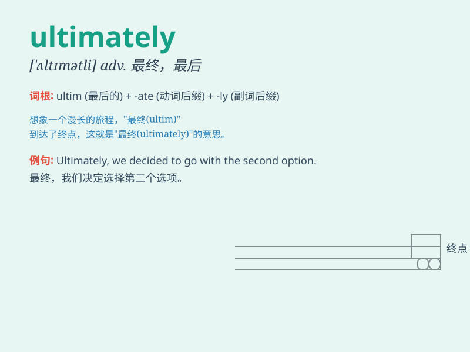

## ultimately

**英音:** _[\'ʌltɪmətlɪ]_ **美音:** _[\'ʌltəmɪtlɪ]_

**译义:** *adv.最后,终于,根本,基本上*

### 短语

+ **ultimately successful:** _最终成功_

+ **ultimately responsible:** _最终负责_

+ **ultimately depend on:** _最终取决于_

+ **ultimately lead to:** _最终导致_

+ **ultimately achieve:** _最终达成_

### 例句

#### 例句1

> **Ultimately, we all want to be happy and fulfilled in life.**

**中文翻译:** 最终，我们都希望在生活中快乐和满足。

**单词释义:** 最终；最后

#### 例句2

> **The project was ultimately successful despite many
challenges.**

**中文翻译:** 尽管面临许多挑战，这个项目最终还是成功了。

**单词释义:** 最终；最后

#### 例句3

> **Ultimately, it\'s your decision whether to take the job or
not.**

**中文翻译:** 最终，是否接受这份工作由你决定。

**单词释义:** 最终；最后

### 背诵小故事

> A brave adventurer set out on a long journey. He faced many
challenges and difficulties. But ultimately, with his perseverance and
wisdom, he reached the destination of his dreams.

**一位勇敢的冒险家踏上了漫长的旅程。他面临许多挑战和困难。但最终，凭借他的毅力和智慧，他到达了梦想的目的地。**

### 图义

