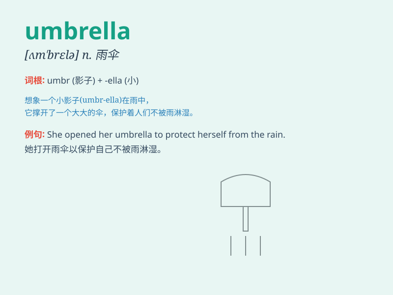

## umbrella

**英音:** _[ʌm\'brelə]_ **美音:** _[ʌm\'brɛlə]_

**译义:** *n.伞,雨伞,庇护*

### 短语

+ **under the umbrella:** _在伞下_

+ **umbrella stand:** _伞架_

+ **beach umbrella:** _沙滩伞_

+ **umbrella term:** _涵盖性术语_

+ **open an umbrella:** _打开一把伞_

### 例句

#### 例句1

> **It\'s raining. Don\'t forget your umbrella.**

**中文翻译:** 天在下雨。别忘了你的雨伞。

**单词释义:** 雨伞

#### 例句2

> **The wind blew my umbrella inside out.**

**中文翻译:** 风把我的雨伞吹得翻转了。

**单词释义:** 雨伞

#### 例句3

> **She carried a colorful umbrella to the beach.**

**中文翻译:** 她带着一把彩色的雨伞去海滩。

**单词释义:** 雨伞

### 背诵小故事

> A rainy day. A little girl is crying because she forgot her umbrella.
A kind old man gives her his umbrella and she smiles. Remember, umbrella
keeps us dry in the rain.

**一个下雨天。一个小女孩在哭，因为她忘了带伞。一位善良的老人把他的伞给了她，她笑了。记住，伞在雨中能让我们保持干爽。**

### 图义

