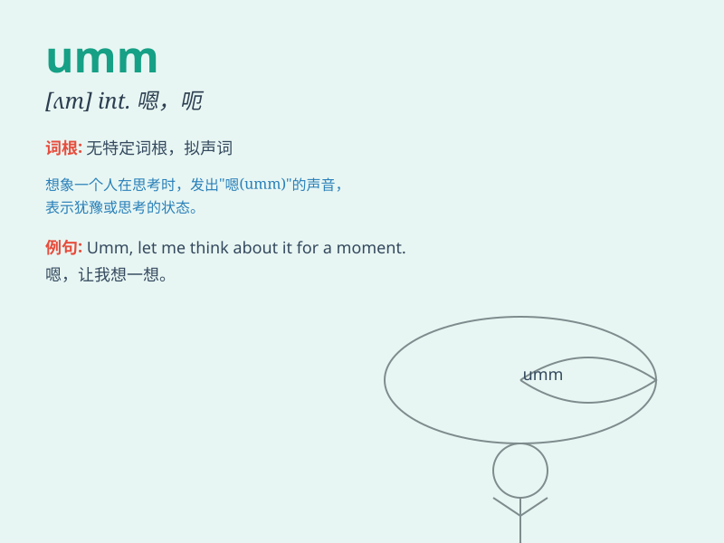

## umm

**英音:** __ **美音:** __

**译义:** *语气词，通常表示犹豫、思考或正在组织语言*

### 短语

+ **umm\... I see:** _嗯......我明白了_

+ **umm, let me think:** _嗯，让我想想_

+ **umm, that\'s strange:** _嗯，那很奇怪_

+ **umm, maybe:** _嗯，也许_

+ **umm, no way:** _嗯，没门_

### 例句

#### 例句1

> **Umm, I\'m not sure if I can come to the party.**

**中文翻译:** 嗯，我不确定我是否能来参加聚会。

**单词释义:** 表示犹豫或思考时发出的声音

#### 例句2

> **Umm, let me think about it for a moment.**

**中文翻译:** 嗯，让我想一想。

**单词释义:** 在思考时的停顿或迟疑

#### 例句3

> **Umm, that\'s a difficult question.**

**中文翻译:** 嗯，那是个难题。

**单词释义:** 表示对问题感到棘手时的反应

### 背诵小故事

> One day, a little boy was lost in thought. When his friend asked him
a question, he just said \'Umm\...\' as he was trying to organize his
ideas. Finally, he gave a clear answer.

**一天，一个小男孩陷入沉思。当他的朋友问他问题时，他只是说'嗯......'，因为他正在整理自己的想法。最后，他给出了一个清晰的答案。**

### 图义

