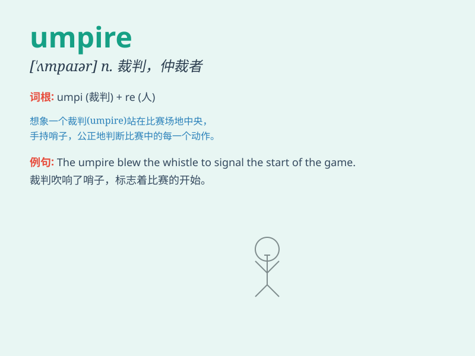

## umpire

**英音:** _[\'ʌmpaɪə]_ **美音:** _[\'ʌmpaɪɚ]_

**译义:** *n.仲裁人,裁判员v.仲裁,任裁判,作裁判*

### 短语

+ **baseball umpire:** _棒球裁判_

+ **football umpire:** _足球裁判_

+ **umpire decision:** _裁判的裁决_

+ **umpire call:** _裁判的判罚_

+ **chief umpire:** _主裁判_

### 例句

#### 例句1

> **The umpire made a controversial call during the baseball
game.**

**中文翻译:** 在棒球比赛中，裁判做出了一个有争议的判罚。

**单词释义:** 裁判

#### 例句2

> **The tennis umpire ensured fair play throughout the
tournament.**

**中文翻译:** 这位网球裁判在整个锦标赛中确保了比赛的公平性。

**单词释义:** 裁判

#### 例句3

> **The umpire signaled that the player was out.**

**中文翻译:** 裁判示意这名球员出局。

**单词释义:** 裁判

### 背诵小故事

> A little boy dreams of becoming an umpire. One day, he gets the
chance in a baseball game. He makes fair decisions and everyone respects
him. Now, whenever he sees the word \'umpire\', he remembers his dream
come true.

**一个小男孩梦想成为一名裁判员。有一天，他在一场棒球比赛中获得了机会。他做出了公平的裁决，每个人都尊重他。现在，每当他看到"umpire"这个词，他就会想起梦想成真的那一刻。**

### 图义

