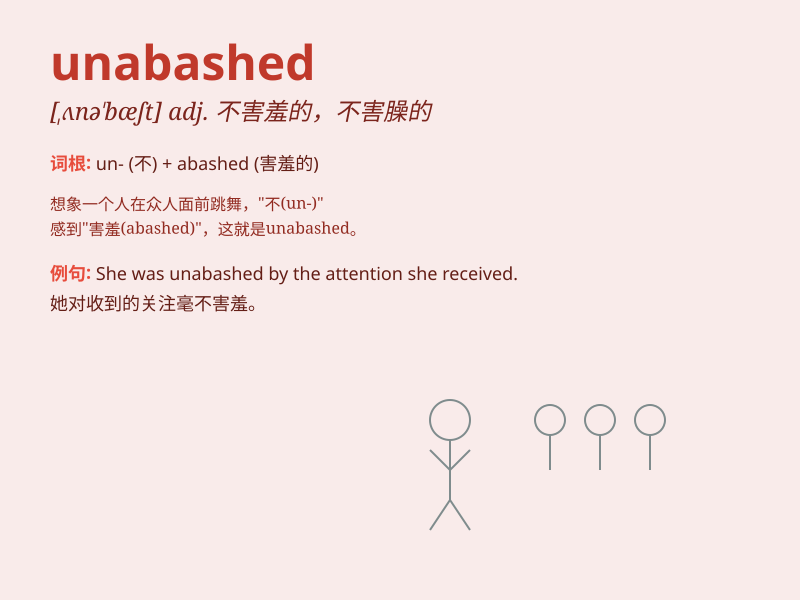

## unabashed

**英音:** _[ʌnə\'bæʃt]_ **美音:** _[,ʌnə\'bæʃt]_

**译义:** *adj.不害羞的*

### 短语

+ **unabashed enthusiasm:** _毫不掩饰的热情_

+ **unabashed confidence:** _毫不畏惧的自信_

+ **unabashed honesty:** _毫无保留的诚实_

+ **unabashed flattery:** _露骨的奉承_

+ **unabashed pride:** _毫不掩饰的骄傲_

### 例句

#### 例句1

> **He was unabashed in his pursuit of success.**

**中文翻译:** 他毫不掩饰自己对成功的追求。

**单词释义:** 毫不掩饰的；不害羞的

#### 例句2

> **The unabashed thief walked out of the store with the stolen
goods.**

**中文翻译:** 那个厚颜无耻的小偷拿着偷来的东西走出了商店。

**单词释义:** 厚颜无耻的；不知羞耻的

#### 例句3

> **She remained unabashed by the criticism and continued her work
with confidence.**

**中文翻译:** 她对批评毫不畏惧，继续自信地工作。

**单词释义:** 毫不畏惧的；泰然自若的

### 背诵小故事

> A thief was unabashed when caught stealing. He showed no shame or
embarrassment. But the police were determined to teach him a lesson.
Unabashed means showing no shame or embarrassment.

**一个小偷被抓到偷东西时毫无羞愧。他没有表现出任何羞耻或尴尬。但警察决心给他一个教训。unabashed
意思是毫无羞愧的；不害臊的**

### 图义

