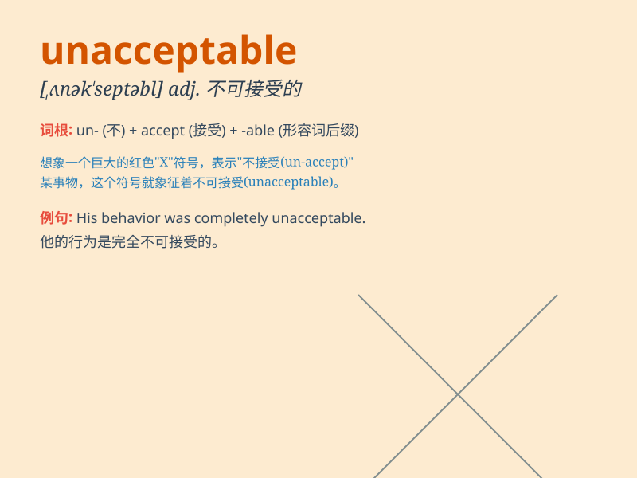

## unacceptable

**英音:** _[ʌnək\'septəb(ə)l]_ **美音:**
_[,ʌnək\'sɛptəbl]_

**译义:** *adj.无法接受的,不受欢迎的*

### 短语

+ **unacceptable behavior:** _不可接受的行为_

+ **unacceptable risk:** _不可接受的风险_

+ **unacceptable level:** _不可接受的水平_

+ **unacceptable delay:** _不可接受的延误_

+ **unacceptable condition:** _不可接受的状况_

### 例句

#### 例句1

> **The quality of the product was unacceptable.**

**中文翻译:** 这个产品的质量是不能接受的。

**单词释义:** 不能接受的；不合意的

#### 例句2

> **His behavior at the party was unacceptable.**

**中文翻译:** 他在聚会上的行为是不可接受的。

**单词释义:** 不可接受的；难以容忍的

#### 例句3

> **The delay in delivery is unacceptable for our business.**

**中文翻译:** 对于我们的业务来说，交货延迟是不可接受的。

**单词释义:** 无法接受的；不被认可的

### 背诵小故事

> A king was very angry when he saw the poor quality of the new castle.
The workmanship was unacceptable. He shouted, \'This is not what I
expected!\'

**一位国王看到新城堡质量很差时非常生气。工艺是不可接受的。他喊道："这不是我所期望的！"**

### 图义

