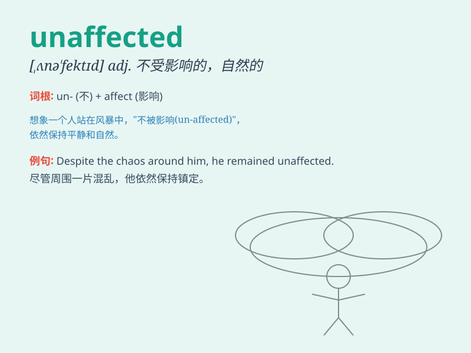

## unaffected

**英音:** _[ʌnə\'fektɪd]_ **美音:** _[,ʌnə\'fɛktɪd]_

**译义:** *adj.不矫揉造作的,自然的,真挚的,未受影响的,未被感动的*

### 短语

+ **unaffected charm:** _自然的魅力_

+ **unaffected style:** _质朴的风格_

+ **unaffected manner:** _真诚的态度_

+ **unaffected simplicity:** _未加修饰的简单_

+ **remain unaffected:** _保持不受影响_

### 例句

#### 例句1

> **She remained unaffected by the criticism and continued to pursue
her goals.**

**中文翻译:** 她没有受到批评的影响，继续追求自己的目标。

**单词释义:** 未受影响的

#### 例句2

> **His unaffected charm made him very popular among his friends.**

**中文翻译:** 他那自然的魅力使他在朋友中很受欢迎。

**单词释义:** 自然的；真挚的

#### 例句3

> **The village has remained largely unaffected by modern
development.**

**中文翻译:** 这个村庄在很大程度上未受现代发展的影响。

**单词释义:** 未被改变的；未受影响的

### 背诵小故事

> 在一个充满虚假的世界里，有一位名叫 Lily
的女孩，她始终保持着真实和真诚，不受外界影响，unaffected
于虚荣和谎言。她的内心坚定，就像一颗闪耀的星星，始终保持着自己的光芒。

**在一个充满虚假的世界中，有个叫莉莉的女孩始终真诚真实，不受虚荣和谎言影响。她内心坚定，像闪耀的星星保持自身光芒。**

### 图义

