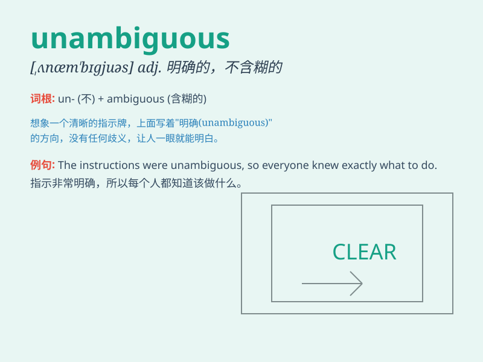

## unambiguous

**英音:** _[ʌnæm\'bɪgjʊəs]_ **美音:**
_[\'ʌnæm\'bɪgjʊəs]_

**译义:** *adj.不含糊的,明确的*

### 短语

+ **unambiguous evidence:** _明确的证据_

+ **unambiguous answer:** _明确的回答_

+ **unambiguous statement:** _明确的声明_

+ **unambiguous conclusion:** _明确的结论_

+ **unambiguous instruction:** _明确的指示_

### 例句

#### 例句1

> **The instructions were unambiguous and easy to follow.**

**中文翻译:** 这些说明清晰明确，易于遵循。

**单词释义:** 清晰明确的

#### 例句2

> **His answer was unambiguous; there was no doubt about his
position.**

**中文翻译:** 他的回答毫不含糊；他的立场毫无疑问。

**单词释义:** 毫不含糊的

#### 例句3

> **The law should be unambiguous to avoid confusion.**

**中文翻译:** 法律应该明确无误以避免混淆。

**单词释义:** 明确无误的

### 背诵小故事

> A detective was solving a case. All the clues were unambiguous. There
was no confusion. It was clear that the thief was the one who had no
alibi. So, \'unambiguous\' means clear and not confusing.

**一位侦探在破案。所有线索都清晰明确。没有任何混淆。很明显，那个没有不在场证明的人就是小偷。所以，\'unambiguous\'意思是清晰明确的、不含糊的。**

### 图义

